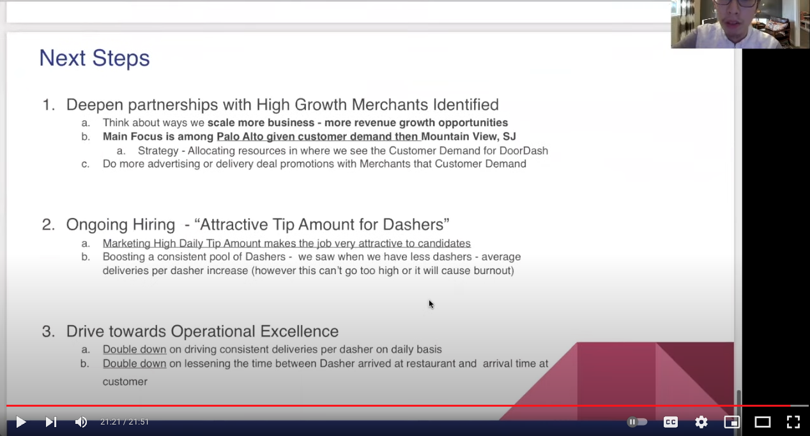
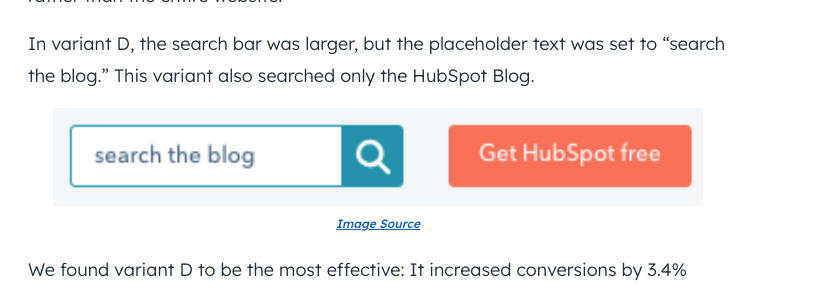
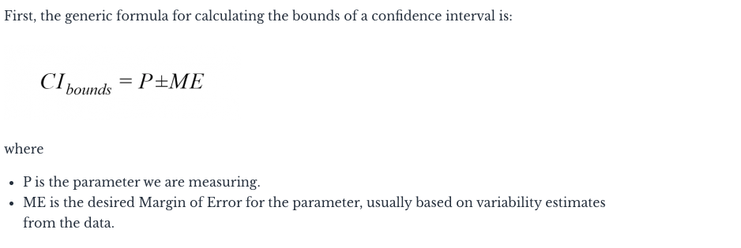
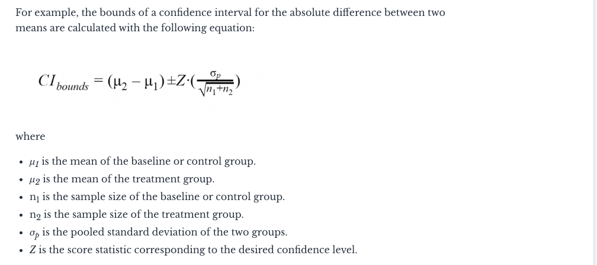

# Analysis

# Questions to ask before starting the case study

## Stage 1
- who is using the data and how will they use it. once a day, once a week. this will determine my orchestration of the data
- shape of the data
- where is the data, what's the data type.
- who needs the data and why?
- What's the flow and sequence of data? Are we collecting that data?

## Stage 2
- Develop data dictionary for core KPIs and metrics needed
- define kpi definitions

## Stage 3
- how can we QA the data
- share with internal users first to get feedback

## Example

Say we have a food delivery service, we implement a new feature, and we want to see its impact on KPIs.

- maybe 2 metrics to keep track of:
1. time from order to delivery
2. customer satisfaction

## Here's a dashboard of metrics

## Here are metrics to know

# Here's another example

and the data

some questions to ask:
- lots of timestamp components. customer placing order, restaurant receiving order, driving arriving at restaurant, driver delivering the food to customer. So look into time duration. Is the marketplace running smoothly? Draw insights from the timestamps to see if delivery is smooth.
- we have restaurant IDs. The restaurant's business. Where are people ordering the food from? Where are they ordering from? Which are most popular restaurants? How many orders? But also most revenue restaurants? Wtihin each city, what are most popular restaurants. Highest orders? Highest revenue.
- customer perspective, what are customers ordering, what's the tip amount/value. correlation between customer tip and order amount.

### Some insights

- palo alto has the most customer spend and volume. those customers order the most.
- also palo alto and mountain view, avg customer order is higher.
- so... perhaps the food delivery company should build corporate seamless plans. entice companies to do that for employee happiness because their employees want it and order a lot.

- some merchants get more than others
- suggest to some merchants to expand or promote those merchants as a recommendation engine.

and then recommendations on what to do:

## case study on conversions (business requirements gathering, identifying right analysis to generate insights, draw conclusions and make recommendations)
(from alessandro, mentorcruise person)

### Topics to learn:
- How people design A/B testing and how to deal with confounding variables.
- network effects: confunding variable. excitements. 
- metrics vs kpi. say metric. that's what we're measuring.
- data analysis. How to analyze data.

### Some notes about setting up an experiment.
- A/B testing. Let's understand this and read up on it.
- how do we collect the data. How will we redirect the traffic in case we want to setup this experiment. control vs variant.
- redirect the traffic with a proxy and randomized groups created on the fly and send the traffic to a different group of users. build an experiment and collect data from these 2 groups. Is what we're testing actually increasing the conversion rate. This is a basic scenario. 
- They may have a constraint, how do we handle this situation?
- A curveball study about taxi drivers: when we have to design an experiment. users and taxis in london. The problem was that basically we wanted to test 2 different pricing models. Two groups of users, one price from one model for one group, one price to another group from another model and after 1 month, we collect results and see which performs better... maybe model A is increasing the conversion rate....or so it seems. The problem is that this experiment can fail but there is something wrong... in 1 area maybe we have prices increasing by 5%. But the taxi drivers can be aware of the change of prices and add **bias**. This form of bias is called network effects. A confounding variable of some sort. So the results that we see are not coming from the actions from our system (the pricing model) but an external confounding variable or network effects. 
- environmental constraints, technical constraint. in this case we were using a framework from Uber and it was allowing us to split the city into small hexagons. Area in London was split into several hexagons. Taxi drivers were aware and they all go to a certain part of the city because the prices were higher for them. But the experimenters realized this and so they switched pricing model A and B every hour instead to keep the taxi drivers from realizing. This was to destroy the confounding variable.
- so either the pricing model is responsible for the increasing taxi bookings, or the network effect. There's a confounding variable. The point is the destroy the connection between the confounding variable and the experiment.
- Another example is ice cream and sunburn...say you see a correlation. Say you see ice cream, you see an increase in sunburn. The key is to destroy the summer and -> sunburn and -> ice creams. randomize the groups destroys the bias in the data. But sometimes this is not enough. A/B testing is not that easy.
- but sometimes randomization can get rid of gender bias but not all bias like network effects in taxi drivers. A lot of users and so gender in both groups. But confounding variables sometimes can't be destroyed by randomization like network effects. Taxi drivers now talk and so maybe it's the network effect (talking and feelings and it's too complicated) and so maybe that's driving bookings.
- adding dimension: this is about B/I. Dimension can be revenue over time.

## A/B testing

A/B testing, also known as split testing, is a marketing experiment wherein you split your audience to test variations on a campaign and determine which performs better. In other words, you can show version A of a piece of marketing content to one half of your audience and version B to another.

A/B testing can be valuable because different audiences behave, well, differently. Something that works for one company may not necessarily work for another.

In fact, conversion rate optimization (CRO) experts hate the term "best practices" because it may not actually be the best practice for you. However, this kind of testing can be complex if you’re not careful.

To run an A/B test, you need to create two different versions of one piece of content, with changes to a single variable.

Then, you'll show these two versions to two similarly sized audiences and analyze which one performed better over a specific period (long enough to make accurate conclusions about your results).

### Some A/B Testing tips
1. Test only one element.
Each variable of your website or ad campaign can significantly impact your intended audience’s behavior. That’s why looking at just one element at a time is important when conducting A/B tests.
Attempting to test multiple elements in the same A/B test will yield unreliable results. With unreliable results, you won't know which element had the biggest impact on consumer behavior.
Be sure to design your split test for just one element of your ad campaign or website.
Pro tip: Don’t try to test multiple elements at once. A good A/B test will be designed to test only one element at a time.

3. Create a 'control' and a 'challenger.'
You now have your independent variable, your dependent variable, and your desired outcome. Use this information to set up the unaltered version of whatever you're testing as your control scenario.
If you're testing a web page, this is the unaltered page as it exists already. If you're testing a landing page, this would be the landing page design and copy you would normally use.
From there, build a challenger — the altered website, landing page, or email that you’ll test against your control.
For example, if you're wondering whether adding a testimonial to a landing page would make a difference in conversions, set up your control page with no testimonials. Then, create your challenger with a testimonial.

9. Test both variations simultaneously.
Timing plays a significant role in your marketing campaign’s results, whether it's the time of day, day of the week, or month of the year.
If you were to run version A during one month and version B a month later, how would you know whether the performance change was caused by the different design or the different month?
When running A/B tests, you must run the two variations simultaneously. Otherwise, you may be left second-guessing your results.
The only exception is if you're testing timing, like finding the optimal times for sending emails.

1. Check your goal metric.
The first step in reading your A/B test results is looking at your goal metric, which is usually conversion rate.
After you’ve plugged your results into your A/B testing calculator, you’ll get two results for each version you’re testing. You’ll also get a significant result for each of your variations.

2. Compare your conversion rates.
By looking at your results, you’ll likely be able to tell if one of your variations performed better than the other. However, the true test of success is whether your results are statistically significant.
For example, variation A had a 16.04% conversion rate. Variation B had a 16.02% conversion rate, and your confidence interval of statistical significance is 95%. Variation A has a higher conversion rate, but the results are not statistically significant, meaning that variation A won’t significantly improve your overall conversion rate.
How to Read A/B Testing Results
As a marketer, you know the value of automation. Given this, you likely use software that handles the A/B test calculations for you — a huge help. But, after the calculations are done, you need to know how to read your results. Let’s go over how.

1. Check your goal metric.
The first step in reading your A/B test results is looking at your goal metric, which is usually conversion rate.
After you’ve plugged your results into your A/B testing calculator, you’ll get two results for each version you’re testing. You’ll also get a significant result for each of your variations.

2. Compare your conversion rates.
By looking at your results, you’ll likely be able to tell if one of your variations performed better than the other. However, the true test of success is whether your results are statistically significant.
For example, variation A had a 16.04% conversion rate. Variation B had a 16.02% conversion rate, and your confidence interval of statistical significance is 95%. Variation A has a higher conversion rate, but the results are not statistically significant, meaning that variation A won’t significantly improve your overall conversion rate.

### A/B test example

1. Site Search
Site search bars help users quickly find what they’re after on a particular website. HubSpot found from previous analysis that visitors who interacted with its site search bar were more likely to convert on a blog post. So, we ran an A/B test to increase engagement with the search bar.
In this test, search bar functionality was the independent variable, and views on the content offer thank you page was the dependent variable. We used one control condition and three challenger conditions in the experiment
The search bar remained unchanged in the control condition (variant A).

In variant B, the search bar was larger and more visually prominent, and the placeholder text was set to “search by topic.”

Variant C appeared identical to variant B but only searched the HubSpot Blog rather than the entire website.

In variant D, the search bar was larger, but the placeholder text was set to “search the blog.” This variant also searched only the HubSpot Blog.
We found variant D to be the most effective: It increased conversions by 3.4% over the control and increased the percentage of users who used the search bar by 6.5%.

## How Does A/B Testing Work?
You start an A/B test by deciding what it is you want to test. Fung gives a simple example: the size of the subscribe button on your website. Then you need to know how you want to evaluate its performance. In this case, let’s say your metric is the number of visitors who click on the button. To run the test, you show two sets of users (assigned at random when they visit the site) the different versions (where the only thing different is the size of the button) and determine which influenced your success metric the most. In this case, which button size caused more visitors to click?

In real life there are lots of things that influence whether someone clicks. For example, it may be that those on a mobile device are more likely to click on a certain size button, while those on desktop are drawn to a different size. This is where randomization can help — and is critical. By randomizing which users are in which group, you minimize the chances that other factors, like mobile versus desktop, will drive your results on average.

“The A/B test can be considered the most basic kind of randomized controlled experiment,” Fung says. “In its simplest form, there are two treatments and one acts as the control for the other.” As with all randomized controlled experiments, you must estimate the sample size you need to achieve a statistical significance, which will help you make sure the result you’re seeing “isn’t just because of background noise,” Fung says.

Sometimes, you know that certain variables, usually those that are not easily manipulated, have a strong effect on the success metric. For example, maybe mobile users of your website tend to click less on anything, compared with desktop users. Randomization may result in set A containing slightly more mobile users than set B, which may cause set A to have a lower click rate regardless of the button size they’re seeing. To level the playing field, the test analyst should first divide the users by mobile and desktop and then randomly assign them to each version. This is called blocking.

The size of the subscribe button is a very basic example, Fung says. In actuality, you might not be testing just the size but also the color, and the text, and the typeface, and the font size. Lots of managers run sequential tests — e.g., testing size first (large versus small), then testing color (blue versus red), then testing typeface (Times versus Arial) — because they believe they shouldn’t vary two or more factors at the same time. But according to Fung, that view has been debunked by statisticians. And sequential tests are suboptimal because you’re not measuring what happens when factors interact. For example, it may be that users prefer blue on average but prefer red when it’s combined with Arial. This kind of result is regularly missed in sequential A/B testing because the typeface test is run on blue buttons that have “won” the prior test.

Instead, Fung says, you should run more-complex tests. This can be hard for some managers, since the appeal of A/B tests are how straightforward and simple they are to run (and many people designing these experiments, Fung points out, don’t have a statistics background). “With A/B testing, we tend to want to run a large number of simultaneous, independent tests,” he says, in large part because the mind reels at the number of possible combinations you can test. But using mathematics you can “smartly pick and run only certain subsets of those treatments; then you can infer the rest from the data.” This is called “multivariate” testing in the A/B testing world and often means you end up doing an A/B/C test or even an A/B/C/D test. In the example above with colors and size, it might mean showing different groups: a large red button, a small red button, a large blue button, and a small blue button. If you wanted to test fonts, too, the number of test groups would grow even more.

How Do You Interpret the Results of an A/B Test?
Chances are that your company will use software that handles the calculations, and it may even employ a statistician who can interpret those results for you. But it’s helpful to have a basic understanding of how to make sense of the output and decide whether to move forward with the test variation (the new button in the example above).

Fung says that most software programs report two conversion rates for A/B testing: one for users who saw the control version, and the other for users who saw the test version. “The conversion rate may measure clicks, or other actions taken by users,” he says. The report might look like this: “Control: 15% (+/- 2.1%) Variation 18% (+/- 2.3%).” This means that 18% of your users clicked through on the new variation (perhaps your larger blue button) with a margin of error of 2.3%. You might be tempted to interpret this as the actual conversion rate falling between 15.7% and 20.3%, but that wouldn’t be technically correct. “The real interpretation is that if you ran your A/B test multiple times, 95% of the ranges will capture the true conversion rate — in other words, the conversion rate falls outside the margin of error 5% of the time (or whatever level of statistical significance you’ve set),” Fung explains.

If this is hard to wrap your head around, join the club. What’s important to know is that the 18% conversion rate isn’t a guarantee. This is where your judgment comes in. An 18% conversation rate is certainly better than a 15% one, even allowing for the margin of error (12.9%–17.1% versus 15.7%–20.3%). You might hear people talk about this as a “3% lift” (lift is simply the percentage difference in conversion rate between your control version and a successful test treatment). In this case, it’s most likely a good decision to switch to your new version, but that will depend on the costs of implementing the new version. If they’re low, you might try out the switch and see what happens in actuality (as opposed to in tests). One of the big advantages to testing in the online world is that you can usually revert back to your original pretty easily.

## How Do Companies Use A/B Testing?
Fung says that the popularity of the methodology has risen as companies have realized that the online environment is well suited to help managers, especially marketers, answer questions like, “What is most likely to make people click? Or buy our product? Or register with our site?” A/B testing is now used to evaluate everything from website design to online offers to headlines to product descriptions. (In fact, last week I looked at the results of A/B testing on the language we use to market a new product here at HBR.)

Most of these experiments run without the subjects even knowing. “As a user, we’re part of these tests all the time and don’t know it,” Fung says.
And it’s not just websites. You can test marketing emails or ads as well. For example, you might send two versions of an email to your customer list (randomizing the list first, of course) and figure out which one generates more sales. Then you can just send out the winning version next time. Or you might test two versions of ad copy and see which one converts visitors more often. Then you know to spend more getting the most successful one out there.

What Mistakes Do People Make When Doing A/B Tests?
I asked Fung about the mistakes he sees companies make when performing A/B tests, and he pointed to three common ones.

First, he says, too many managers don’t let the tests run their course. Because most of the software for running these tests lets you watch results in real time, managers want to make decisions too quickly. This mistake, he says, “evolves out of impatience,” and many software vendors have played into this overeagerness by offering a type of A/B testing called “real-time optimization,” in which you can use algorithms to make adjustments as results come in. The problem is that, because of randomization, it’s possible that if you let the test run to its natural end, you might get a different result.

The second mistake is looking at too many metrics. “I cringe every time I see software that tries to please everyone by giving you a panel of hundreds of metrics,” he says. The problem is that if you’re looking at such a large number of metrics at the same time, you’re at risk of making what statisticians call “spurious correlations.” In proper test design, “you should decide on the metrics you’re going to look at before you execute an experiment and select a few. The more you’re measuring, the more likely that you’re going to see random fluctuations.” With so many metrics, instead of asking yourself, “What’s happening with this variable?” you’re asking, “What interesting (and potentially insignificant) changes am I seeing?”

Lastly, Fung says that few companies do enough retesting. “We tend to test it once and then we believe it. But even with a statistically significant result, there’s a quite large probability of false positive error. Unless you retest once in a while, you don’t rule out the possibility of being wrong.” False positives can occur for several reasons. For example, even though there may be little chance that any given A/B result is driven by random chance, if you do lots of A/B tests, the chances that at least one of your results is wrong grows rapidly.

This can be particularly difficult to do because it is likely that managers would end up with contradictory results, and no one wants to discover that they’ve undermined previous findings, especially in the online world, where managers want to make changes — and capture value — quickly. But this focus on value can be misguided, Fung says: “People are not very vigilant about the practical value of the findings. They want to believe that every little amount of improvement is valuable even when the test results are not fully reliable. In fact, the smaller the improvement, the less reliable the results.”

It’s clear that A/B testing is not a panacea. There are more complex kinds of experiments that are more efficient and will give you more reliable data, Fung says. But A/B testing is a great way to gain a quick understanding of a question you have. And “the good news about the A/B testing world is that everything happens so quickly, so if you run it and it doesn’t work, you can try something else. You can always flip back to the old tactic.”

## Some a/b testing mistakes

Lastly, Fung says that few companies do enough retesting. “We tend to test it once and then we believe it. But even with a statistically significant result, there’s a quite large probability of false positive error. Unless you retest once in a while, you don’t rule out the possibility of being wrong.” False positives can occur for several reasons. For example, even though there may be little chance that any given A/B result is driven by random chance, if you do lots of A/B tests, the chances that at least one of your results is wrong grows rapidly.

This can be particularly difficult to do because it is likely that managers would end up with contradictory results, and no one wants to discover that they’ve undermined previous findings, especially in the online world, where managers want to make changes — and capture value — quickly. But this focus on value can be misguided, Fung says: “People are not very vigilant about the practical value of the findings. They want to believe that every little amount of improvement is valuable even when the test results are not fully reliable. In fact, the smaller the improvement, the less reliable the results.”

### Sampling Error

When you run the results, you find that those who saw the new campaign spent $10.17 on average, more than the $8.41 those who saw the old one spent. This $1.76 might seem like a big — and perhaps important — difference. But in reality you may have been unlucky, drawing a sample of people who do not represent the larger population; in fact, maybe there was no difference between the two campaigns and their influence on consumers’ purchasing behaviors. This is called a sampling error, something you must contend with in any test that does not include the entire population of interest.

Redman notes that there are two main contributors to sampling error: the size of the sample and the variation in the underlying population. Sample size may be intuitive enough. Think about flipping a coin five times versus flipping it 500 times. The more times you flip, the less likely you’ll end up with a great majority of heads. The same is true of statistical significance: With bigger sample sizes, you’re less likely to get results that reflect randomness. All else being equal, you’ll feel more comfortable in the accuracy of the campaigns’ $1.76 difference if you showed the new one to 1,000 people rather than just 25. Of course, showing the campaign to more people costs more, so you have to balance the need for a larger sample size with your budget.

Then you collect your data, plot the results, and calculate statistics, including the p-value, which incorporates variation and the sample size. If you get a p-value lower than your target, then you reject the null hypothesis in favor of the alternative. Again, this means the probability is small that your results were due solely to chance.

Closely related to the idea of a significance level is the notion of a confidence interval. Let’s take the example of a political poll. Say there are two candidates: A and B. The pollsters conduct an experiment with 1,000 “likely voters”; 49% of the sample say they’ll vote for A, and 51% say they’ll vote for B. The pollsters also report a margin of error of +/- 3%.

“Technically,” says Redman, “49% +/-3% is a ‘95% confidence interval’ for the true proportion of A voters in the population.” Unfortunately, he says, most people interpret this as “there’s a 95% chance that A’s true percentage lies between 46% and 52%,” but that isn’t correct. Instead, it says that if the pollsters were to do the result many times, 95% of intervals constructed this way would contain the true proportion.

If your head is spinning at that last sentence, you’re not alone. As Redman says, this interpretation is “maddeningly subtle, too subtle for most managers and even many researchers with advanced degrees.” He says the more practical interpretation of this would be “Don’t get too excited that B has a lock on the election” or “B appears to have a lead, but it’s not a statistically significant one.” Of course, the practical interpretation would be very different if 70% of the likely voters said they’d vote for B and the margin of error was 3%.

### Important stats concepts to relearn
- confidence intervals
- p value
- margin of error
- what is statistically significant?
- false positive

### Confidence and p-values

Statistical significance is most practically used in hypothesis testing. For example, you want to know whether changing the color of a button on your website from red to green will result in more people clicking on it. If your button is currently red, that’s called your “null hypothesis,” which takes the form of your experiment baseline. Turning your button green is known as your “alternative hypothesis.” 

To determine the observed difference in a statistical significance test, you will want to pay attention to two outputs: p-value and the confidence interval. 
 
P-value can be defined as the likelihood of seeing evidence as strong or stronger in favor of a difference in performance between your variation and baseline, calculated assuming there actually is no difference between them and any lift observed is entirely owed to random fluke. P-values do not communicate how large or small your effect size is or how important the result might be.  
 
Confidence interval refers to an estimated range of values that are likely, but not guaranteed, to include the unknown but exact value summarizing your target population if an experiment was replicated numerous times. An interval is comprised of a point estimate (a single value derived from your statistical model of choice) and a margin of error around that point estimate. Best practices are to report confidence intervals to supplement your statistical significance results, as they can offer information about the observed effect size of your experiment.

The formula for the absolute difference of proportions (i.e. conversion rates of all kinds) is the same—they’re just a special type of mean. Examining the formula, we can see why it’s a random interval: The interval bounds depend on:

The random error introduced by the observed difference in the means;
The error in estimating the standard deviation of said difference.
Visualized as a distribution of the error of the mean, an interval bound cuts a certain percentage of a distribution centered on the observed value—to the left, to the right, or on both sides.

We can also see that the larger the sample size, the narrower the width of the interval. This happens since we are dividing the pooled standard deviation by a larger number, which ultimately results in a smaller number being added or subtracted from the observed parameter value.

With an infinite sample size, the interval collapses into a single point on the real line. This follows our intuition: The more data we have, the less uncertainty an estimate of the parameter of interest should have.

Further, requiring a higher confidence level means a larger value for Z, resulting in a wider interval, and vice versa. A 99% confidence interval will always be wider than a 95% confidence interval, all else being equal.

### P value

P-Value 
Cassie Kozyrkov, Google’s Chief Decision Scientist coined a very simple definition to explain P-Value: “The lower the p-value, the more ridiculous the null hypothesis looks!”

What is P-value in A/B testing?
P-value is defined as the probability of observing an outcome as extreme or more extreme than the one observed, assuming that the null hypothesis is true. Hence, the p-value is a mathematical device to check the validity of the null hypothesis. The smaller the p-value, the surer we are that we should reject the null hypothesis. 
### Sample size and effect size
Sample size refers to how large the sample for your experiment is. The larger your sample size, the more confident you can be in the result of the experiment (assuming that it is a randomized sample). If you are running tests on a website, the more traffic your site receives, the sooner you will have a large enough data set to determine if there are statistically significant results. You will run into sampling errors if your sample size is too low.
Effect size refers to the magnitude of the difference in outcomes between the two sample sets and communicates the practical significance of your results.  
 
Beyond these two factors, a key thing to remember is the importance of randomized sampling. If traffic to a website is split evenly between two pages, but the sampling isn’t random, it can introduce errors due to differences in behavior of the sampled population. 

For example, if 100 people visit a website and all the men are shown one version of a page and all the women are shown a different version, then a comparison between the two is not possible, even if the traffic is split 50-50, because the difference in demographics could introduce variations in the data. A truly random sample is needed to determine that the result of the experiment is statistically significant. 

## Statistical power
reall good post: https://cxl.com/blog/statistical-power/

My enthusiastic, yet misguided, belief was that I simply needed to find aspects to optimize, set up the tool, and start the test. After that, I thought, it was just a matter of awaiting the infamous 95% statistical significance.

I was wrong.

After implementing “statistically significant” variations, I experienced no lift in sales because there was no true lift—“it was imaginary.” Many of those tests were doomed at inception. I was committing common statistical errors, like not testing for a full business cycle or neglecting to take the effect size into consideration.

I also failed to consider another possibility: That an “underpowered” test could cause me to miss changes that would generate a “true lift.”

Understanding statistical power, or the “sensitivity” of a test, is an essential part of pre-test planning and will help you implement more revenue-generating changes to your site.

**Statistical power is the probability of observing a statistically significant result at level alpha (α) if a true effect of a certain magnitude is present. It allows you to detect a difference between test variations when a difference actually exists.**

Statistical power is the crowning achievement of the hard work you put into conversion research and properly prioritized treatment(s) against a control. This is why power is so important—it increases your ability to find and measure differences when they’re actually there.

Statistical power (1 – β) holds an inverse relationship with Type II errors (β). It’s also how to control for the possibility of false negatives. We want to lower the risk of Type I errors to an acceptable level while retaining sufficient power to detect improvements if test treatments are actually better.

Finding the right balance, as detailed later, is both art and science. If one of your variations is better, a properly powered test makes it likely that the improvement is detected. If your test is underpowered, you have an unacceptably high risk of failing to reject a false null.

### Type I errors
A Type I error, or false positive, rejects a null hypothesis that is actually true. Your test measures a difference between variations that, in reality, does not exist. The observed difference—that the test treatment outperformed the control—is illusory and due to chance or error.

The probability of a Type I error, denoted by the Greek alpha (α), is the level of significance for your A/B test. If you test with a 95% confidence level, it means you have a 5% probability of a Type I error (1.0 – 0.95 = 0.05). (from me: This is because alpha is the false positive rate. 95% of the time the vvalue falls within the confidence interval. So 5% of the time we have a type 1 error where we reject the null incorrectly.)

If 5% is too high, you can lower your probability of a false positive by increasing your confidence level from 95% to 99%—or even higher. This, in turn, would drop your alpha from 5% to 1%. But that reduction in the probability of a false positive comes at a cost. By increasing your confidence level, the risk of a false negative (Type II error) increases. This is due to the inverse relationship between alpha and beta—lowering one increases the other. So if your type 1 error goes down, your type 2 error (false negative) goes up. 

Lowering your alpha (e.g. from 5% to 1%) reduces the statistical power of your test. As you lower your alpha, the critical region becomes smaller, and a smaller critical region means a lower probability of rejecting the null—hence a lower power level. Conversely, if you need more power, one option is to increase your alpha (e.g. from 5% to 10%).

### Type 2 error

A Type II error, or false negative, is a failure to reject a null hypothesis that is actually false. A Type II error occurs when your test does not find a significant improvement in your variation that does, in fact, exist.

Beta (β) is the probability of making a Type II error and has an inverse relationship with statistical power (1 – β). If 20% is the risk of committing a Type II error (β), then your power level is 80% (1.0 – 0.2 = 0.8). You can lower your risk of a false negative to 10% or 5%—for power levels of 90% or 95%, respectively.

Type II errors are controlled by your chosen power level: the higher the power level, the lower the probability of a Type II error. Because alpha and beta have an inverse relationship, running extremely low alphas (e.g. 0.001%) will, if all else is equal, vastly increase the risk of a Type II error.

Statistical power is a balancing act with trade-offs for each test. As Paul D. Ellis says, “A well thought out research design is one that assesses the relative risk of making each type of error, then strikes an appropriate balance between them.”

## A/A Testing

- if your test group is representative of the population, then the 20% is usually due to noise in the data. Take a test group, and a "B" group, and if you ssee a difference, perhaps sample size is too small. We as data engineers take care of the whole technical infrastructure of this A/A test. This will show you perhaps something is not setup correctly in the test or the sample size is too small. This is done for A/A testing. if there is a difference in the data, then we need to change our test setup.

- effect size - the difference in distributions. Calculate difference in the mean. Take distribution of the two groups and you compare them. YOu get effect size number How much the two groups are different. It's a kind of noise in the data.

## Things to do before

