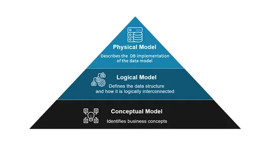

# Data modeling interview

## Star schema/Fact/Dimension tables

Dimensional data modeling is a technique used in data warehousing to organize data into a format that is easy to understand and efficient for querying. This approach focuses on improving the readability and accessibility of data for end-users, typically for business intelligence and reporting purposes. Here are the fundamental concepts of dimensional data modeling:

1. Star Schema
Structure: The star schema is the simplest form of dimensional data model. It consists of a central fact table surrounded by dimension tables.
Fact Table: Contains quantitative data (measures) for analysis, such as sales amount, quantity sold, etc. It has foreign keys that reference primary keys in the dimension tables.

Dimension Tables: Contain descriptive attributes (dimensions) related to the measures. Examples include customer details, product information, store location, etc.

Advantages: Simplifies queries, improves performance, and is easy for users to understand.

### Why are dimensional models more read friendly than highly normalized OLTP systems?

Dimensional models, particularly the star schema, are optimized for read operations primarily due to their simplicity and the way they organize data. While it might seem counterintuitive at first, considering that normalization typically involves splitting up tables and creating more joins, the star schema's structure actually enhances its read efficiency for several reasons:

1. Simplified Query Logic
Fewer Joins: In a star schema, queries generally involve straightforward joins between a central fact table and related dimension tables. This simplicity contrasts with the multiple joins often necessary in highly normalized schemas (like those in OLTP systems).
Intuitive Structure: The star schema aligns closely with business logic, making it easier to write queries. Users can easily understand the relationship between different entities (like sales and customers).

 Denormalization
Reduced Table Complexity: Dimension tables in a star schema are denormalized, meaning they are not split into multiple related tables. This reduces the number of joins needed to fetch related data.
Improved Query Performance: Denormalization often results in redundant data, but it also leads to faster query execution because the database can retrieve all necessary information from fewer tables.

Practical Trade-offs: While normalization (like in a snowflake schema) can reduce redundancy, it often complicates queries and can degrade performance. The star schema offers a practical balance for analytical querying.

## OLTP vs OLAP

OLTP Systems:
Highly Normalized: Data in OLTP systems is often normalized up to the *third normal form (3NF)* or even higher.
Objective: To optimize for transactional speed, consistency, and *minimize data redundancy*.
Example: In a retail database, you might have separate tables for Customers, Orders, OrderDetails, Products, and Suppliers. Each table contains only the data specific to that entity and is linked to others via foreign keys. For instance, OrderDetails would reference Orders and Products to avoid duplication.

### 3NF

3NF ensures that non-key properties only depend on the primary key, removing redundancy and helping to create a well-organized and normalized relational database model.

### Disadvantages of 3NF
The disadvantage of the 3NF form design technique is that creating a database of smaller, normalized tables means that when you want to start performing analytics and business intelligence, you experience poor query performance because you have to join a bunch of smaller tables together to answer the questions you are seeking to address. The overhead of these “joins” greatly impacts database performance and results in long query times and sometimes the queries timeout altogether and don’t finish.  The other disadvantage with this design technique is that your database overwrites previous values with the most current version of a transaction, and thus it is hard to track changes over time, which is important for analytics.

Dimensional Models:
Less Normalized/Denormalized: Dimensional models, particularly those using a star schema, are denormalized.
Objective: To optimize for read performance and simplicity in querying, often at the cost of some data redundancy.
Example: In a dimensional model for the same retail scenario, you might have a Sales fact table which records each transaction. It's connected to dimension tables like Customer, Product, Time, etc. These dimension tables are denormalized; for example, the Product table might include not just product details but also information about the supplier directly in the same table, leading to some redundancy.\

Comparison Using an Example:
Suppose you want to analyze total sales by product category and customer city.

In an OLTP System: You'd need to join multiple tables (like Orders, OrderDetails, Customers, Products, Suppliers) to gather this information. This requires complex queries with multiple joins, which can be computationally expensive.

In a Dimensional Model (Star Schema): You'd primarily query the Sales fact table, which would have foreign keys linked to Customer and Product dimension tables. The dimension tables are more comprehensive, including details like customer city and product category directly. This means fewer and simpler joins, leading to faster query execution.

In summary, dimensional models trade off some normalization for increased efficiency in data retrieval, which is crucial in analytics and reporting scenarios. This contrast with OLTP systems prioritizes transactional efficiency and *data integrity*, often requiring more complex and numerous joins in queries due to their highly normalized structure.

### Fact Tables/Types of Fact Tables:
Transactional: Record events at a point in time (e.g., sales transactions).

Periodic Snapshot: Capture data at regular intervals (e.g., monthly sales summary).

Accumulating Snapshot: Track the status of an event over time (e.g., order fulfillment status).

Fact Table Granularity: Refers to the level of detail or the "grain" of the data stored in the fact table. The grain defines the most atomic level at which data is stored.

### Dimension Tables
Descriptive Attributes: Provide context to the numeric measures in the fact table (e.g., customer name, product category).

Slowly Changing Dimensions (SCD): Techniques to manage and track changes in dimension attributes over time. SCDs are crucial for maintaining historical accuracy in data warehousing.

### Conformed Dimensions
Definition: Dimensions that are reusable across different fact tables.

Purpose: Ensure consistency in reporting and analysis across different areas of the business.

## Snowflake schema

Snowflake Schema
Extended Star Schema: The snowflake schema is a variant of the star schema, where **dimension tables are normalized**, splitting them into additional tables.

Normalization: Reduces data redundancy and improves data integrity but can result in more complex queries and potentially slower performance.

Use Case: More suitable for environments where data redundancy must be minimized.

## Hierarchies and Aggregations
Hierarchies: Represent relationships within dimensions, such as geographic regions (country > state > city) or time (year > quarter > month).

Aggregations: Pre-calculated summary data, improving query performance but increasing storage requirements.

## conceptual/logical/physical

This next section breaks down the 3
### Conceptual Data Modeling
Conceptual data modeling is creating a data model for a given system by analyzing and documenting the data objects and their relationships without regard to any particular database management system. It is a high-level data model that describes the structure of a business domain without concern for the physical implementation of the data.

Some examples of Conceptual Data Modeling are online shopping apps, simple library systems’ and hotel reservation systems.

## Logical Data Modeling 
Logical Data Modeling is a process used to define and analyze data requirements needed to support business processes. This process involves identifying and organizing data objects into entities, defining relationships between those entities, and establishing rules and constraints that govern the data. Logical Data Models outline the structure of a system’s data and provide a detailed view of the data that a system will contain.

Examples of Logical Data Models include Entity-Relationship Diagrams (ERDs), which are used to define the relationships between entities, and Object-Oriented Data Models, which are used to define the structure of objects.

## Physical Data Modeling
Physical data modeling is a process that involves the creation of diagrams, graphs, and other visual representations of a database structure to understand and document its elements and the relationships among them. This type of modeling is used to define the structure of a database, identify relationships between different elements, and document a database’s overall design.

Examples of physical data modeling include entity-relationship diagrams (ERDs), data flow diagrams (DFDs), and Unified Modeling Language (UML) diagrams.

Q2. What is the difference between Conceptual, Logical, and Physical data models?
A. The question is included in almost all data modeling interview questions. Hence, you can briefly define and support the terms with a real-life example.

Conceptual Data Models: They provide a high-level overview of the data and relationships between different entities. They are used to define the scope and structure of a database.

Logical Data Models: They describe the data structure and their relationships within a database. They include data elements and the relationships between them.

Physical Data models: They are used to define the actual data structures of a database. They include the data types, field sizes, and indexes used in the database._

