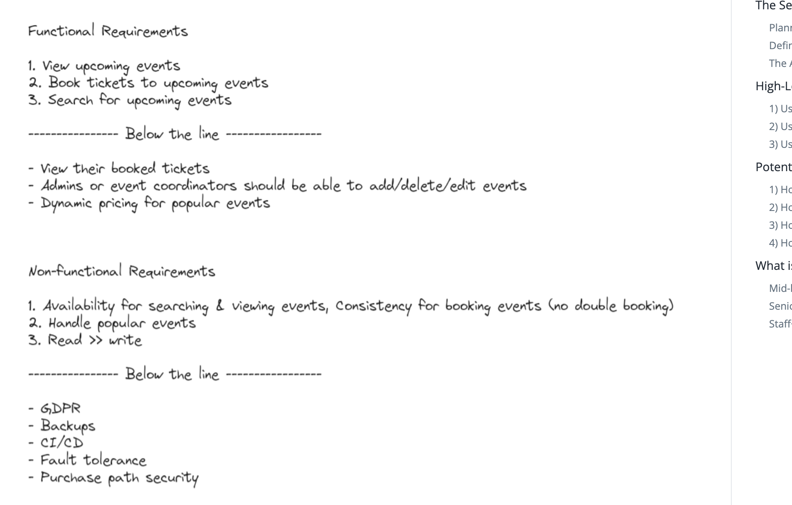
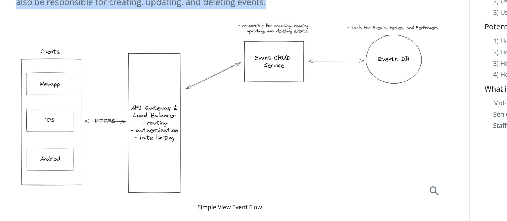
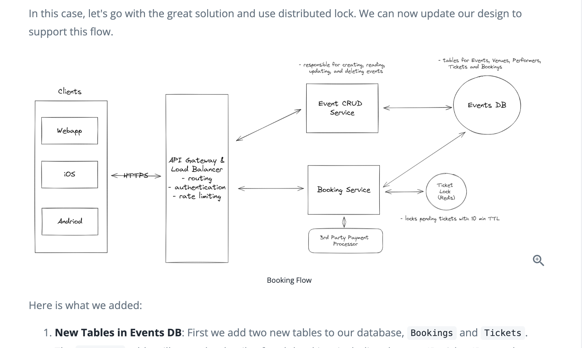
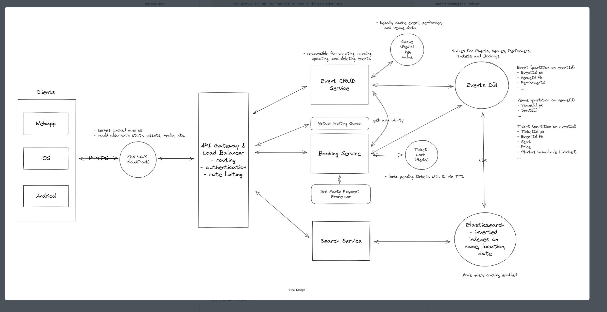

# Let's design ticketmaster

1. Start your interview by defining the functional and non-functional requirements. For user facing applications like this one, functional requirements are the "Users should be able to..." statements whereas non-functional defines the system qualities via "The system should..." statements.

2. Prioritize the top 3 functional requirements. Everything else shows your product thinking, but clearly note it as "below the line" so the interviewer knows you won't be including them in your design. Check in to see if your interviewer wants to move anything above the line or move anything down. Choosing just the top 3 is important to ensuring you stay focused and can execute in the limited time window.
 
3. When evaluating non-functional requirements, it's crucial to uncover the distinct characteristics that make this system challenging or unique. To help you identify these, consider the following questions:
- CAP theorem: Does this system prioritize availability or consistency? Note, that in some cases, the answer is different depending on the part of the system -- as you'll see is the case here.
- Read vs write ratio: is this a read heavy system or write heavy? Are either notably heavy for any reason?
- Query access pattern: Is the access pattern of the system regular or are their patterns or bursts that require particular attention. For example, the holidays for shopping sites or popular events for ticket booking.


## Functional Requirements
### Core Requirements
Users should be able to view events
Users should be able to book tickets to events
Users should be able to search for events

### Below the line (out of scope):
Users should be able to view their booked events
Admins or event coordinators should be able to add events
Popular events should have dynamic pricing

## Non-functional components

Core Requirements

- The system should prioritize availability for searching & viewing events, but should prioritize consistency for booking events (no double booking)
- The system should be scalable and able to handle high throughput in the form of popular events
- The system is read heavy, and thus needs to be able to support high read throughput
- 
Below the line (out of scope):
- The system should protect user data and adhere to GDPR
- The system should be fault tolerant
- The system should provide secure transactions for purchases
- The system should be well tested and easy to deploy (CI/CD pipelines)
- The system should have regular backups



## Approach
Before you move on to designing the system, it's important to start by taking a moment to plan your strategy. Fortunately, for these common users facing product-style questions, the plan should be straightforward: build your design up sequentially, going one by one through your functional requirements. This will help you stay focused and ensure you don't get lost in the weeds as you go. Once you've satisfied the functional requirements, you'll rely on your non-functional requirements to guide you through the deep dives.

## Entitites

To satisfy our key functional requirements, we'll need the following entities:

Event: This entity stores essential information about an event, including details like the date, description, type, and the performer or team involved. It acts as the central point of information for each unique event.

Performer: Represents the individual or group performing or participating in the event. Key attributes for this entity include the performer's name, a brief description, and potentially links to their work or profiles. (Note: this could be artist, company, collective — a lot of different entities. The choice of “performer” is intending to be general enough to cover all possible groups)

Venue: Represents the physical location where an event is held. Each venue entity includes details such as address, capacity, and a specific seat map, providing a layout of seating arrangements unique to the venue.

Ticket: Contains information related to individual tickets for events. This includes attributes such as the associated event ID, seat details (like section, row, and seat number), pricing, and status (available or sold).

Booking: Records the details of a user's ticket purchase. It typically includes the user ID, a list of ticket IDs being booked, total price, and booking status (such as in-progress or confirmed). This entity is key in managing the transaction aspect of the ticket purchasing process.


## API

The API for viewing events is straightforward. We create a simple GET endpoint that takes in an eventId and return the details of that event.
```
GET /events/details/{eventId} -> Event & Venue & Performer & Ticket[]
```

- tickets are to render the seat map on the Client
The ticket booking process is divided into two steps:

- The user first chooses a specific seat or ticket to buy.
- They then progress to a payment page to complete the purchase.
- 
We want to guarantee that once a user selects a ticket, it is reserved for them until they complete the purchase, preventing it from being bought by someone else while they try to check out.

We’re going to need two API endpoints, one for each of the steps in the process:

```
POST /booking/checkout -> bookingId
 {
   "ticketIds": string[]
 }

POST /booking/confirm -> Success / Failure
{
    "bookingId": string
    "paymentDetails": ...
}
```

## High level Design

1. user should be able to view events 
  
- When a user navigates to www.yourticketmaster.com/event/{eventId} they should see details about that event. Crucially, this should include a seatmap showing seat availability. The page will also display the event's name, along with a description. Key information such as the location (including venue details), event dates, and facts about the performers or teams involved could be outlined.

- We start by laying out the core components for communicating between the client and our microservices. We add our first service, "Event CRUD Service," which connects to a database to store the event, venue, and performer data outlined in the Data Model above. This service will handle the reading/viewing of events. Although we are not currently focused on the admin flow for this design, this service would theoretically also be responsible for creating, updating, and deleting events.


Clients: There are three primary clients - WebApp, iOS, and Android. Users will interact with the system through these clients. All client requests will be routed to the system's backend through a Load Balancer.

Load Balancer: Its primary purpose is to distribute incoming application traffic across multiple targets, such as the API Gateway, in this case. This increases the availability and fault tolerance of the application.

API Gateway: This serves as an entry point for clients to access the different microservices of the system. This layer can also handle authentication, rate limiting, and other cross-cutting concerns.

Event CRUD Service: Our first microservice is responsible for creating, reading, updating, and deleting events. In relation to our requirement to view events, this service is responsible for handling view API requests by fetching the necessary event, venue, and performer information from the database and returning the results to the client.

Events DB: Stores tables for events, performers, and venues.
Let's walk through exactly what happens when a user makes a request to www.yourticketmaster.com/event/{eventId} to view an event.

### What exactly happens?
The client makes a REST GET request with the eventId

Our load balancer accepts the request and routes it to the API gateway with the fewest current connections.

The API gateway then, after handling basic authentication and rate limiting, forward the request onto our Event CRUD Service.

The Event CRUD Service then queries the Events DB for the event, venue, and performer information and returns it to the client.

## Users should be able to book tickets
This time we have a bit more to consider though. We need to ensure that the ticket is locked for the user while they are checking out. We also need to ensure that if the user abandons the checkout process, the ticket is released for other users to purchase. Finally, we need to ensure that if the user completes the checkout process, the ticket is marked as sold and the booking is confirmed. Here are a couple ways we could do this:

### Bad solution
This involves locking  row in the database

A bad solution many candidates propose for this problem is to use database locking. In this method, the database is directly utilized to lock a specific ticket row, ensuring exclusive access to the first user trying to book it. This is typically done using the SELECT FOR UPDATE statement in PostgreSQL, which locks the selected row(s) as part of a database transaction. The lock on the row is maintained until the transaction is either committed or rolled back. During this time, other transactions attempting to select the same row with SELECT FOR UPDATE will be blocked until the lock is released. This ensures that only one user can process the ticket booking at a time.

When it comes to unlocking, there are two cases we need to consider:

- If the user finalizes the purchase, the transaction is committed, the database lock is released, and the ticket status is set to "Booked".
- If the user takes too long or abandons the purchase, the system has to rely on their subsequent actions or session timeouts to release the lock. This introduces the risk of tickets being locked indefinitely if not appropriately handled.

#### Challenges for database row locking

Why is this a bad idea? Well, database locks are meant to be used for short periods of time (a single, near-instant, transaction). Keeping a transaction open for a long period (like the 5-minute lock duration) is generally not advisable. It can strain database resources and increase the risk of lock contention and deadlocks. Additionally, SQL DBs like PostgreSQL doesn't natively support lock timeouts within transactions. Implementing a timeout would require application-level management and additional complexity. Finally, this approach may not scale well under high load, as prolonged locks can lead to increased wait times for other users and potential performance bottlenecks. Handling edge cases, such as application crashes or network issues, becomes more challenging, as these could leave locks in an uncertain state.


### Better solution with REdis

Approach
A great solution is to implement a distributed lock with a TTL (Time To Live) using a distributed system like Redis. Redis is an in-memory data store that supports distributed locks and is well-suited for high-concurrency environments. It offers high availability and can be used to implement a distributed lock mechanism for the ticket booking process. Here is how it would work:

When a user selects a ticket, acquire a lock in Redis using a unique identifier (e.g., ticket ID) with a predefined TTL (Time To Live). This TTL acts as an automatic expiration time for the lock.
If the user completes the purchase, the ticket's status in the database is updated to "Booked", and the lock in Redis is manually released by the application after the TTL.
If the TTL expires (indicating the user did not complete the purchase in time), Redis automatically releases the lock. This ensures that the ticket becomes available for booking by other users without any additional intervention.
Now our Ticket table only has two states: available and booked. Locking of reserved tickets is handled entirely by Redis.

#### Challenges
The main downside comes with handling failures. If our lock goes down for any reason, then we have a period of time where user experience is degraded. Note that we will still never have a "double booking" since our database will use OCC or any other concurrency control to ensure this. The downside is just that users can get an error after filling out their payment details if someone beats them to it. This sucks, but I would argue that it is a better outcome than having all tickets appear unavailable (as would be the case if the cron job in our previous solution failed).

### Solution


Here is what we added:

New Tables in Events DB: First we add two new tables to our database, Bookings and Tickets. The Bookings table will store the details of each booking, including the user ID, ticket IDs, total price, and booking status. The Tickets table will store the details of each ticket, including the event ID, seat details, pricing, and status. The Tickets table will also have a bookingId column that links it to the Bookings table.

Booking Service: This microservice is responsible for the core functionality of the ticket booking process. It interacts with databases that store data on bookings and tickets.
It interfaces with the Payment Processor (Stripe) for transactions. Once a payment is confirmed, the booking service updates the ticket status to "sold".
It communicates with the Bookings and Tickets tables to fetch, update, or store relevant data.
It utilizes a Redis Distributed Lock to ensure that a ticket is locked for a user while they are checking out. This lock is released once the user completes the purchase or if the TTL expires.

Payment Processor (Stripe): An external service responsible for handling payment transactions. Once a payment is processed, it notifies the booking service of the transaction status.

Ticket Lock: A distributed lock is implemented using Redis to ensure that a ticket is locked for a user while they are checking out. This lock is released once the user completes the purchase or if the TTL of 10 minutes expires.

### Now, when a user wants to book a ticket:

A user will select a seat from the interactive seat map. This will trigger a POST /booking/checkout with the ticketId associated with that seat.
The request will be forwarded from our load balancer, to our API gateway, and onto the Booking Service.
The Booking Service will lock that ticket by adding it to our Redis Distributed Lock with a TTL of 10 minutes (this is how long we will hold the ticket for).
The Booking Service will also write a new booking entry in the DB with a status of in-progress.
We will then respond to the user with their newly created bookingId and route the client to a the payment page.
If the user stops here, then after 10 minutes the lock is auto-released and the ticket is available for another user to purchase.
The user will fill out their payment details and click “Purchase.” In doing so, the payment (along with the bookingId) gets sent to Stripe for processing and Stripe responds via webhook that the payment was successful.
Upon successful payment confirmation from Stripe, our system's webhook retrieves the bookingId embedded within the Stripe metadata. With this bookingId, the webhook initiates a database transaction to concurrently update the Ticket and Booking tables. Specifically, the status of the ticket linked to the booking is changed to "sold" in the Ticket table. Simultaneously, the corresponding booking entry in the Booking table is marked as "confirmed."
Now the ticket is booked!


## Some deep dives

### How is the view API going to scale to support 10s of millions of concurrent requests during popular events?

In our non-functional requirements we mentioned that our view and search paths need to be highly available, including during peak traffic scenarios. To accomplish this, we need a combination of load balancing, horizontal scaling, and caching.

Great Solution: Caching, Load Balancing, and Horizontal Scaling

#### Approach

Utilize Caching

Prioritize caching for data with high read rates and low update frequency, such as event details (names, dates, venue information), performer bios, and static venue details like location and capacity. Because this data does not change frequently, we can cache it like crazy to heavily minimize the load of our SQL DB and meet our high availability requirements.

Cache key-value pairs like eventId:eventObject to efficiently serve frequently accessed data.

Utilize Redis or Memcached as in-memory data stores, leveraging their speed for handling large volumes of read operations. A read-through cache strategy ensures data availability, with cache misses triggering a database read and subsequent cache update.

#### Cache Invalidation and Consistency:
- Set up database triggers to notify the caching system of data changes, such as updates in event dates or performer lineups, to invalidate relevant cache entries.
- Implement a Time-to-Live policy for cache entries, ensuring periodic refreshes. These TTLs can be long for static data like venue information and short for frequently updated data like event availability.
Load Balancing

Use algorithms like Round Robin or Least Connections for even traffic distribution across server instances. Implement load balancing for all horizontally scaled services and databases. You typically don't need to show this in your design, but it's good to mention it.
Horizontal Scaling

The Event CRUD Service is stateless which allows us to horizontally scale it to meet demand. We can do this by adding more instances of the service and load balancing between them.


### How will the system ensure a good user experience during high-demand events with millions simultaneously booking tickets?

With popular events, the loaded seat map will go stale quickly. Users will grow frustrated as they repeatedly click on a seat, only to find out it has already been booked. We need to ensure that the seat map is always up to date and that users are notified of changes in real-time.

Sometimes the best solution is actually not technically more challenging. The mark of a senior/staff engineer is their ability to solve business problems and sometimes that means thinking outside the box of presumed constraints. The below Good and Great solutions are illustrative of a common delta between senior and staff candidates.

With popular events, the loaded seat map will go stale quickly. Users will grow frustrated as they repeatedly click on a seat, only to find out it has already been booked. We need to ensure that the seat map is always up to date and that users are notified of changes in real-time.


#### Good Solution: SSE for Real-Time Seat Updates

##### Approach

To ensure that the seat map is always up to date, we can use Server-Sent Events (SSE) to push updates to the client in real-time. This will allow us to update the seat map as soon as a seat is booked (or reserved) by another user without needing to refresh the page. SSE is a unidirectional communication channel between the server and the client. It allows the server to push data to the client without the client having to request it.

##### Challenges

While this approach works well for moderately popular events, the user experience will still suffer during extremely popular events. In the "Taylor Swift case," for example, the seat map will immediately fill up, and users will be left with a disorienting and overwhelming experience as available seats disappear in an instant


### How can you improve search to handle complex queries and high-volume traffic more efficiently?


#### Good Solution: Indexing & SQL Query Optimization

##### Approach
- Create indexes on the Event, Performer, and Venues tables to improve query performance. Indexes allow for faster data retrieval by mapping the values in specific columns to their corresponding rows in the table. This speeds up search queries by reducing the number of rows that need to be scanned. We want to index the columns that are frequently used in search queries, such as event name, event date, performer name, and venue location.
- Optimize queries to improve performance. This includes techniques like using EXPLAIN to analyze query execution plans, avoiding SELECT * queries, and using LIMIT to restrict the number of rows returned. Additionally, using UNION instead of OR for combining multiple queries can improve performance.

##### Challenges
- Standard indexes are less effective for queries involving partial string matches (e.g., searching for "Taylor" instead of the full "Taylor Swift"). This requires additional considerations, like implementing full-text search capabilities or using LIKE operators, which can be less efficient.
- While indexes improve query performance, they can also increase storage requirements and slow down write operations, as each insert or update may necessitate an index update.
- Finding the right balance between the number of indexes and overall database performance, especially considering the diverse and complex query patterns in a ticketing system.


#### Great Solution: Use a Full-text Search Engine like Elasticsearch

##### Approach
Add Elasticsearch or a similar full-text search engine. Elasticsearch is a powerful search engine that excels in full-text search, complex query execution, and handling high-volume traffic efficiently. At its core, Elasticsearch operates using inverted indexes, a key feature that makes it highly efficient for search operations. Inverted indexes allow Elasticsearch to quickly locate and retrieve data by mapping each unique word to the documents or records it appears in, significantly speeding up search queries.

To make sure the data in Elasticsearch is always in sync with the data in our SQL DB, we can use change data capture (CDC) for real-time or near-real-time data synchronization from PostgreSQL to Elasticsearch. This setup captures changes in the PostgreSQL database, such as inserts, updates, and deletes, and replicates them to the Elasticsearch index.
We can enable fuzzy search functionality with Elasticsearch, which allows for error tolerance in search queries. This is way we can handle typos and slight variations in spellings such as "Taylor Swift" vs "Tayler Swift". This is something that would be very difficult to do with SQL alone.

##### Challenges
Keeping the Elasticsearch index synchronized with PostgreSQL can be complex and requires a reliable mechanism to ensure data consistency.
Maintaining an Elasticsearch cluster adds additional infrastructure complexity and cost.

## Final design


