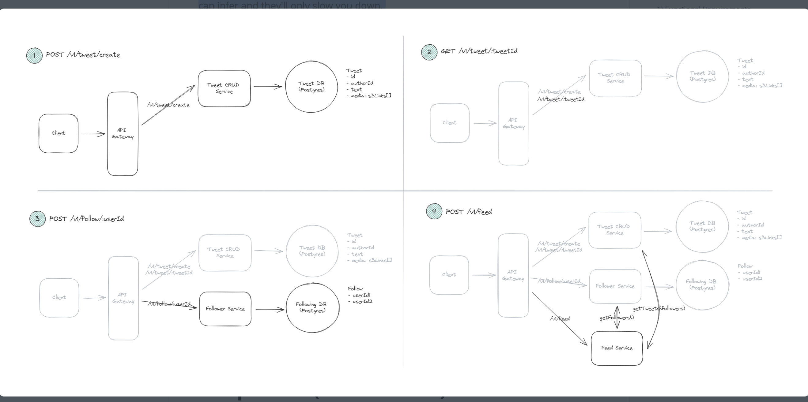

# List of common entities

## API Gateway
An API gateway is a tool that manages application programming interfaces (APIs) and acts as a single point of entry between the application user and backend services. It receives requests from the user, routes them to the appropriate services, gathers the data, and combines the results for the user in a single package.

An API gateway simplifies API management by providing one central point of control that helps developers focus on building individual services rather than being encumbered by complex networks of APIs. It also acts as a first line of defense, preventing malformed or malicious requests from reaching backend systems.

Some common functions of an API gateway include:
Authentication, Routing, Rate limiting, Billing, Monitoring, Analytics, Policies, Alerts, and Security. 

An API gateway can handle all the tasks involved in accepting and processing up to hundreds of thousands of concurrent API calls, including traffic management, CORS support, authorization and access control, throttling, monitoring, and API version management. 

