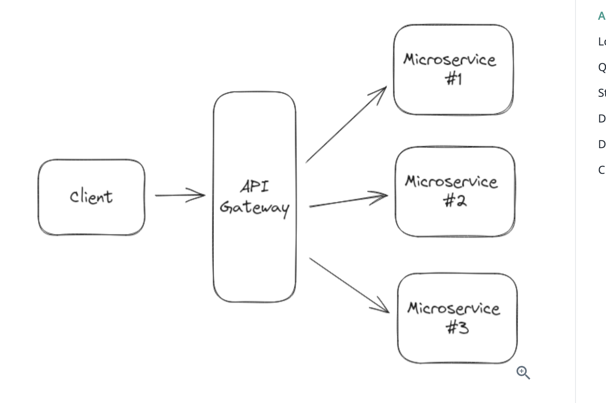
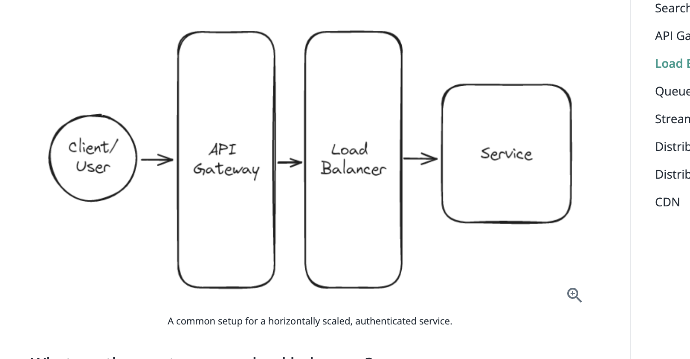

# Key technologies

System design involves assembling the most effective building blocks to solve a problem. Therefore, it is crucial to have a good understanding of the monst commonly used building blocks. Most interviewers aren't going to care whether you know about a particular e.g. queueing solution so long as you have one you can use. However, if you don't know about any queueing solutions, you're going to have a hard time designing a system that requires one. In this section, we outline the key technologies relevant to solving 95% of system design problems together with some discussion of the possible options for each.

Keep in mind from the Levelling section that the amount of depth your interviewer is likely to probe is proportional to the level you're interviewing at. A mid-level candidate who can roughly describe ElasticSearch as a search index is likely to be fine, but a senior candidate who can't describe the inverted index or reason about its scaling is likely to be a yellow flag. In either case, focus on breadth before depth!

## Databases

Almost all system design problems will require you to store some data and you're most likely going to be storing it in a database (or Blob Storage). While there are many different types of databases, the most common are relational databases (e.g. Postgres) and NoSQL databases (e.g. DynamoDB) - we recommend you pick one of these for your interview. If you are taking predominately product design interviews, we recommend you pick a relational database. If you are taking predominately infrastructure design interviews, we recommend you pick a NoSQL database.

**TIP:**
Many candidates trip themselves up by trying to insert a comparison of relational and NoSQL databases into their answer. The reality is that these two technologies are highly overlapping and broad statements like "I need to use a relational database because I have relationships in my data" (NoSQL databases can work great for this) or "I've gotta use NoSQL because I need scale and performance" (relational databases, used correctly, perform and scale incredibly well) are often yellow flags that reveal inexperience.

Here's the truth: most interviewers don't need an explicit comparison of SQL and NoSQL databases in your session and it's a pothole you should completely avoid. Instead, talk about what you know about the database you're using and how it will help you solve the problem at hand. If you're asked to compare, focus on the differences in the databases you're familiar with and how they would impact your design. So "I'm using Postgres here because its ACID properties will allow me to maintain data integrity" is a great leader.

### RElational databases

Relational databases (sometimes called RDBMS or Relational Database Management Systems) are the most common type of database. They're often used for transactional data (e.g. user records, order records, etc) and are typically the default choice for a product design interview. Relational databases store your data in tables, which are composed of rows and columns. Each row represents a single record, and each column represents a single field on that record. For example, a users table might have a name column and an email column. Relational databases are often queried using SQL, a declarative language for querying data.

Beyond simply storing data, relational databases come equipped with several features which are useful for system design interviews. The most important of these are:

SQL Joins: Joins are a way of combining data from multiple tables. For example, if you have a users table and a posts table, you might want to query for all posts by a particular user. This is important for querying data and SQL databases can support arbitrary joins between tables.

Indexes: Indexes are a way of storing data in a way that makes it faster to query. For example, if you have a users table with a name column, you might create an index on the name column. This would allow you to query for users by name much faster than if you didn't have an index. Indexes are often implemented using a B-Tree or a Hash Table. The great thing about relational databases is (a) their support for arbitrarily many indexes, which allows you to optimize for different queries and (b) their support for multi-column and specialized indexes (e.g. geospatial indexes, full-text indexes).

RDBMS Transactions: Transactions are a way of grouping multiple operations together into a single atomic operation. For example, if you have a users table and a posts table, you might want to create a new user and a new post for that user at the same time. If you do this in a transaction, either both operations will succeed or both will fail. This is important for maintaining data integrity.

### NoSQL

NoSQL databases are a broad category of databases designed to accommodate a wide range of data models, including key-value, document, column-family, and graph formats. Unlike relational databases, NoSQL databases do not use a traditional table-based structure and are often schema-less. This flexibility allows NoSQL databases to handle large volumes of unstructured, semi-structured, or structured data, and to scale horizontally with ease.

### Blog storage

Sometimes you'll need to store large, unstructured blobs of data. This could be images, videos, or other files. Storing these large blogs in a traditional database is both expensive and inefficient and should be avoided when possible. Instead, you should use a blob storage service like Amazon S3 or Google Cloud Storage. These platforms are specifically designed for handling large blobs of data, and are much more cost effective than a traditional database.

Blog storage services are simple. You can upload a blob of data and that data is stored and get back a URL. You can then use this URL to download the blob of data. Often times blog storage services work in conjunction with CDNs, so you can get fast downloads from anywhere in the world. Upload a file/blob to blob storage which will act as your origin, and then use a CDN to cache the file/blob in edge locations around the world.

**NEAT TIP:**
Avoid using blog storage like S3 as your primary data store unless you have a very good reason. In a typical settup you will have a core database like Postgres or DynamoDB that has pointers (just a url) to the blobs stored in S3. This allows you to use the database to query and index the data, while still getting the benefits of cheap blob storage.

Design Youtube -> Store videos in blob storage, store metadata in a database.
Design Instagram -> Store images & videos in blob storage, store metadata in a database.
Design Dropbox -> Store files in blob storage, store metadata in a database.

## Search Optimized databases

What is a search optimized database and when should you use it?

Sometimes you're tasked with implementing full-text search as a feature of your design. Full-text search is the ability to search through a large amount of text data and find relevant results. This is different from a traditional database query, which is usually based on exact matches or ranges. Without a search optimized database, you would need to run a query that looks something like this:

```postgresql
SELECT * FROM documents WHERE document_text LIKE '%search_term%'
```

This query is slow and inefficient, and it doesn't scale well because it requires a full table scan. Search optimized databases, on the other hand, are specifically designed to handle full-text search. They use techniques like indexing, tokenization, and stemming to make search queries fast and efficient. In short, they work by building what are called inverted indexes. An inverted index is a fundamental data structure used in search engines to enable fast full-text searches. At its core, an inverted index reverses the document-to-word relationship to a word-to-document relationship. Here’s how it works and why it’s effective for search operations:

### How an Inverted Index Works
In a traditional forward index, you might list each document along with the words it contains. An inverted index, on the other hand, lists each word along with the documents that contain that word.

The key idea is to allow quick lookup of documents that contain a specific word, rather than starting with a document and searching for words within it.

### Structure of an Inverted Index
Conceptually, an inverted index is like a dictionary or a map data structure, where:
- Keys are the words found in the documents.
- Values are lists or sets of document identifiers where those words appear.

Examples here are straight forward, consider an application like Ticketmaster that needs to search through a large number of events to find relevant results. Or a social media platform like Twitter that needs to search through a large number of tweets to find relevant results. In either case, a search optimized database would be an optimal choice.

### Things you should know about search optimized databases
Inverted Indexes: As just mentioned, search optimized databases use inverted indexes to make search queries fast and efficient. An inverted index is a data structure that maps from words to the documents that contain them. This allows you to quickly find documents that contain a given word.

Tokenization: Tokenization is the process of breaking a piece of text into individual words. This allows you to map from words to documents in the inverted index.

Stemming: Stemming is the process of reducing words to their root form. This allows you to match different forms of the same word. For example, "running" and "runs" would both be reduced to "run".

Fuzzy Search: Fuzzy search is the ability to find results that are similar to a given search term. Most search optimized databases support fuzzy search out of the box as a configuration option. In short, this works by using algorithms that can tolerate slight misspellings or variations in the search term. This is achieved through techniques like edit distance calculation, which measures how many letters need to be changed, added, or removed to transform one word into another.


Example:
The clear leader in this space is Elasticsearch. Elasticsearch is a distributed, RESTful search and analytics engine that is built on top of Apache Lucene. It is designed to be fast, scalable, and easy to use. It is the most popular search optimized database and is used by companies like Netflix, Uber, and Yelp. Elasticsearch has hosted offerings like Elastic Cloud and AWS OpenSearch which make it easy to get started.

### Advantages of Inverted Indexes
Efficiency in Search: Instead of scanning each document for a particular word (which would be slow and inefficient), the search engine can directly access the list of documents that contain the word in the index.

Speed: Lookup operations in an inverted index are typically very fast, often implemented with hash tables or search trees, allowing near-instantaneous access to the indexed data.

Scalability: Inverted indexes support efficient updates and additions. When new documents are added, the index can be updated by adding entries for new words or updating the list of documents for existing words.

## API Gateway

Esspecially in a microservice architecture, an API gateway sits in front of your system and is responsible for routing incoming requests to the appropriate backend service. For example, if the sytem receives a request to `GET /users/123`, the API gateway would route that request to the users service and return the response to the client. The gateway is also typically also responsible for handling cross-cutting concerns like authentication, rate limiting, and logging.




## Load Balancer

Most system design problems will require you to design a system that can handle a large amount of traffic. When you have a large amount of traffic, you will need to distribute that traffic across multiple machines to avoid overloading any single machine (called horizontal scaling). This is where a load balancer comes in. For the purposes of an interview, you can assume that your load balancer is a black box that will distribute work across your system.

The reality is that you need a load balancer wherever you have multiple machines capable of handling the same request. However, in an interview, it can be redundant to draw a load balancer in front of every service. Instead, either omit a load balancer from your design altogether (and just mention that the services are horizontally scaled) or add one only to the front of the design as an abstraction.



## Queues

Queues serve as buffers for bursty traffic or as a means of distributing work across a system. A compute resource sends messages to a queue and forgets about them. On the other end, a pool of workers (also compute resources) processes the messages at their own pace. Messages can be anything from a simple string to a complex object.

**TIP:**Be careful of introducing queues into synchronous workloads. If you have strong latency requirements (e.g. < 500ms), introducing a queue will likely break your latency constraints.

### REasons for queues

Buffer for Bursty Traffic: In a ride-sharing application like Uber, queues can be used to manage sudden surges in ride requests. During peak hours or special events, ride requests can spike massively. A queue buffers these incoming requests, allowing the system to process them at a manageable rate without overloading the server or degrading the user experience.

Distribute Work Across a System: In a cloud-based photo processing service, queues can be used to distribute expensive image processing tasks. When a user uploads photos for editing or filtering, these tasks are placed in a queue. Different worker nodes then pull tasks from the queue, ensuring even distribution of workload and efficient use of computing resources.

### More on queues

Message Ordering: Most queues are FIFO (first in, first out), meaning that messages are processed in the order they were received. However, some queues (like Kafka) allow for more complex ordering guarantees, such as ordering based on a specified priority or time.

Retry Mechanisms: Many queues have built-in retry mechanisms that attempt to redeliver a message a certain number of times before considering it a failure. You can configure retries, including the delay between attempts, and the maximum number of attempts.

Dead Letter Queues: Dead letter queues are used to store messages that cannot be processed. They're useful for debugging and auditing, as it allows you to inspect messages that failed to be processed and understand why they failed.

Scaling with Partitions: Queues can be partitioned across multiple servers so that they can scale to handle more messages. Each partition can be processed by a different set of workers. Just like databases, you will need to specify a partition key to ensure that related messages are stored in the same partition.

Backpressure: Backpressure is a way of slowing down the production of messages when the queue is overwhelmed. This helps prevent the queue from becoming a bottleneck in your system. For example, if a queue is full, you might want to reject new messages or slow down the rate at which new messages are accepted, potentially returning an error to the user or producer.

What are the most common queueing technologies?
The most common queueing technologies are Kafka and SQS. Kafka is a distributed streaming platform that can be used as a queue, while SQS is a fully managed queue services provided by AWS.


## Distributed Locks

What are distributed locks and when should you use them?
When you're dealing with online systems like Ticketmaster, you might need a way to lock a resource - like a concert ticket - for a short time (~10 minutes in this case). This is so while one user is in the middle of buying a ticket, no one else can grab it. Traditional databases with ACID properties use transaction locks to keep data consistent, which is great for ensuring that while one user is updating a record, no one else can update it, but they're not designed for longer-term locking. This is where distributed locks come in handy.

Distributed locks are perfect for situations where you need to lock something across different systems or processes for a reasonable period of time. They're often implemented using a distributed key-value store like Redis or Zookeeper. The basic idea is that you can use a key-value store to store a lock and then use the atomicity of the key-value store to ensure that only one process can acquire the lock at a time. For example, if you have a Redis instance with a key ticket-123 and you want to lock it, you can set the value of ticket-123 to locked. If another process tries to set the value of ticket-123 to locked, it will fail because the value is already set to locked. Once the first process is done with the lock, it can set the value of ticket-123 to unlocked and another process can acquire the lock.

### Usages of distributed locks

Another handy feature of distributed locks is that they can be set to expire after a certain amount of time. This is great for ensuring that locks don't get stuck in a locked state if a process crashes or is killed. For example, if you set the value of ticket-123 to locked and then the process crashes, the lock will expire after a certain amount of time (like after 10 minutes) and another process can acquire the lock at that point.

Here are some common examples of when to use a distributed lock in a system design interview:

E-Commerce Checkout System: Use a distributed lock to hold a high-demand item, like limited-edition sneakers, in a user's cart for a short duration (like 10 minutes) during checkout to ensure that while one user is completing the payment process, the item isn't sold to someone else.

Ride-Sharing Matchmaking: A distributed lock can be used to manage the assignment of drivers to riders. When a rider requests a ride, the system can lock a nearby driver, preventing them from being matched with multiple riders simultaneously. This lock can be held until the driver confirms or declines the ride or until a certain amount of time has passed.

Distributed Cron Jobs: For systems that run scheduled tasks (cron jobs) across multiple servers, a distributed lock ensures that a task is executed by only one server at a time. For instance, in a data analytics platform, a daily job aggregates user data for reports. A distributed lock can prevent the duplication of this task across multiple servers to save compute resources.

Online Auction Bidding System: In an online auction, a distributed lock can be used during the final moments of bidding to ensure that when a bid is placed in the last seconds, the system locks the item briefly to process the bid and update the current highest bid, preventing other users from placing a bid on the same item simultaneously.

### Otherthings to know

Locking Mechanisms: There are different ways to implement distributed locks. One common implementation uses Redis and is called Redlock. Redlock uses multiple Redis instances to ensure that a lock is acquired and released in a safe and consistent manner.

Lock Expiry: Distributed locks can be set to expire after a certain amount of time. This is important for ensuring that locks don't get stuck in a locked state if a process crashes or is killed.

Locking Granularity: Distributed locks can be used to lock a single resource or a group of resources. For example, you might want to lock a single ticket in a ticketing system or you might want to lock a group of tickets in a section of a stadium.

Deadlocks: Deadlocks can occur when two or more processes are waiting for each other to release a lock. Think about a situation where two processes are trying to acquire two locks at the same time. One process acquires lock A and then tries to acquire lock B, while the other process acquires lock B and then tries to acquire lock A. This can lead to a situation where both processes are waiting for each other to release a lock, causing a deadlock. You should be prepared to discuss how to prevent this.

## Distributed Cache

What is a distributed cache and when should you use it?
In most system design interviews you'll be tasked with both scaling your system and lowering system latency. One common way to do this is to use a distributed cache. A cache is just a server, or cluster of servers, that stores data in memory. They're great for storing data that's expensive to compute or retrieve from a database.

You'll want to use a cache to:

Save Aggregated Metrics: Consider an analytics platform that aggregates data from numerous sources to display a dashboard of metrics. The data for these metrics is expensive to compute, so the platform calculates maetrics asynchronously (like hourly via a background job) and stores the results in a distributed cache. When a user requests a dashboard, the platform can retrieve the data from the cache instead of recomputing it, reducing latency.

Reduce Number of DB Queries: In a web application, user sessions are often stored in a distributed cache to reduce the load on the database. This is especially important for systems that need to support a large number of concurrent users. When a user logs in, the system can store their session data in the cache, allowing the system to quickly retrieve the data when the user makes a request.

Speed Up Expensive Queries: Some complex queries take a long time to run on a traditional, disk based database. For example, if you have a social media platform like Twitter, you might want to show users a list of posts from people they follow. This is a complex query that requires joining multiple tables and filtering by multiple columns. Running this query on Postgres could take ages. Instead, you can run the query once, store the results in a distributed cache, and then retrieve the results from the cache when a user requests them.

### Other things to know about caches

Eviction Policy: Distributed caches have different eviction policies that determine which items are removed from the cache when the cache is full. Some common eviction policies are:

Least Recently Used (LRU): Evicts the least recently accessed items first.
First In, First Out (FIFO): Evicts items in the order they were added.
Least Frequently Used (LFU): Removes items that are least frequently accessed.
Cache Invalidation Strategy: This is the strategy you'll use to ensure that the data in your cache is up to date. For example, if you are designing Ticketmaster and caching popular events, then you'll need to evalidate an event in the cache if the event in your Database was updated (like the venue changed).

Cache Write Strategy: This is the strategy you use to make sure that data is written to your cache in a consistent way. Some strategies are:

- Write-Through Cache: Writes data to both the cache and the underlying datastore simultaneously. Ensures consistency but can be slower for write operations.
- Write-Around Cache: Writes data directly to the datastore, bypassing the cache. This can minimize cache pollution but might increase data fetch times on subsequent reads.
- Write-Back Cache: Writes data to the cache and then asynchronously writes the data to the datastore. This can be faster for write operations but can lead to data loss if the cache is not persisted to disk.

Don't forget to be explicit about what data you are storing in the cache, including the data structure you're using. Remeber, modern caches have many different datastructures you can leverage, they are not just simple key-value stores. So for example, if you are storing a list of events in your cache, you might want to use a sorted set so that you can easily retrieve the most popular events. Many candidates will just say, "I'll store the events in a cache" and leave it at that. This is a missed opportunity and may invite follow-up questions.

What are the most common distributed cache technologies?
The two most common in-memory caches are Redis and Memcached. Redis is a key-value store that supports many different data structures, including strings, hashes, lists, sets, sorted sets, bitmaps, and hyperloglogs. Memcached is a simple key-value store that supports strings and binary objects.
