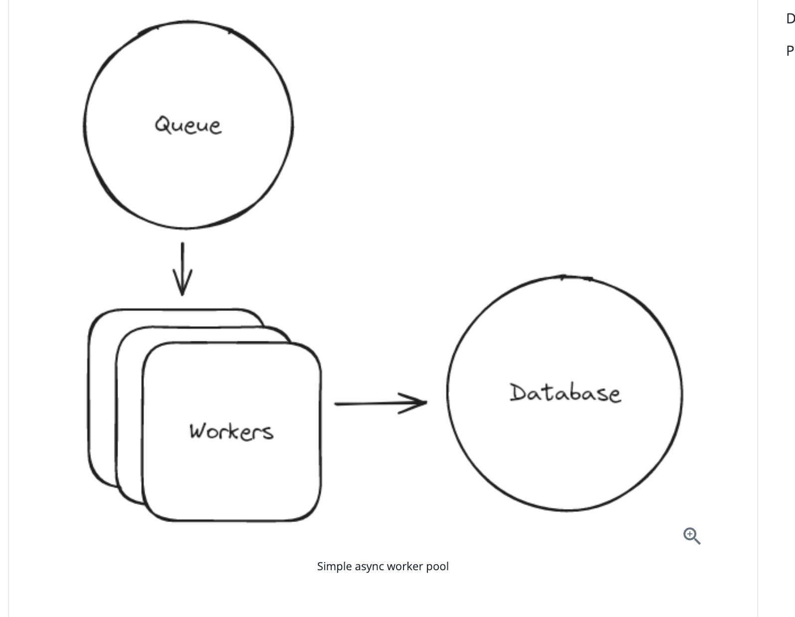

# Patterns

By taking these key technologies and concepts and combining them, you can build a wide variety of systems. We've identified a few common patterns that you can use to build systems. These patterns are not mutually exclusive, and you'll often find yourself combining them to build a system. Further examples can be found in our Problem Guides like Design Ticketmaster which walk you through an entire system design interview.

## Crud Service with caching

The most common pattern is a simple CRUD service that uses a database for storage and caching to improve performance. This is the pattern you'll use for most web applications. You'll use a database to store your data, and a cache to improve performance. You'll also use a load balancer to distribute traffic across multiple instances of your service.

Many designs will start with this pattern and then add additional complexity as requirements are added. For example, you might start with a simple CRUD service and then add a search index to improve search performance. Or you might start with a simple CRUD service and then add a queue to handle asynchronous processing.

## Async job worker pool

If you have a system which needs to handle a lot of processing and can tolerate some delay, you might use an async job worker pool. This pattern is common in systems that need to process a lot of data, like a social network that needs to process a lot of images or videos. You'll use a queue to store jobs, and a pool of workers to process them.

A popular option for the queue is SQS, and for the workers, you might use a pool of EC2 instances or Lambda functions. SQS guarantees at least once delivery of messages and the workers will respond back to the queue with heartbeat messages to indicate that they are still processing the job. If the worker fails to respond with a heartbeat, the job will be retried on another host.

