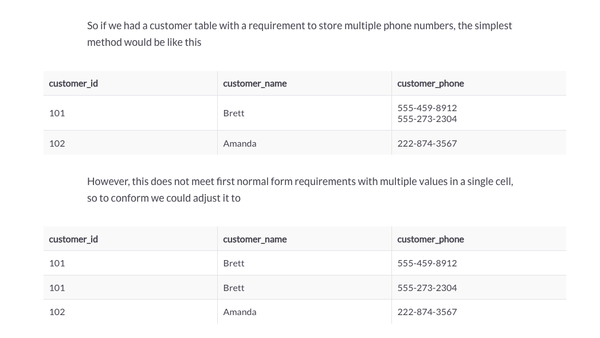
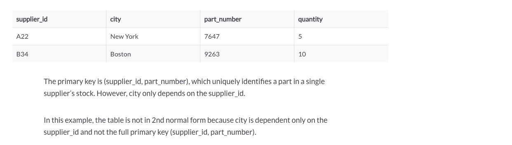
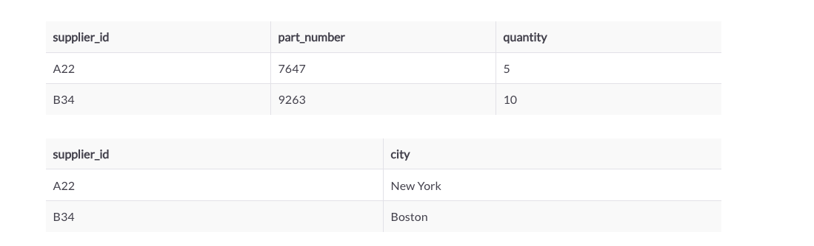
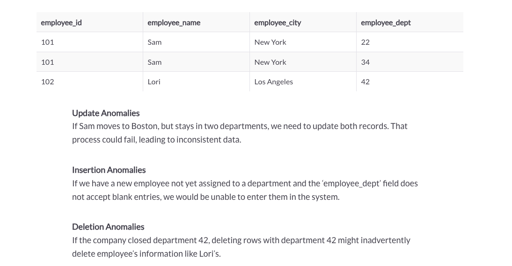
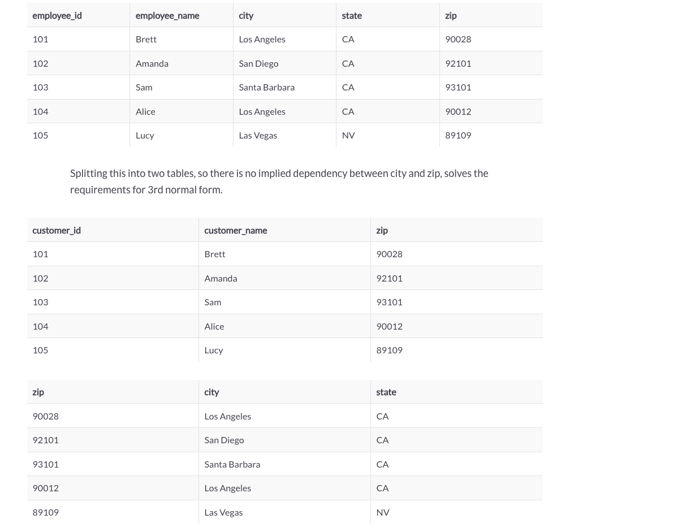
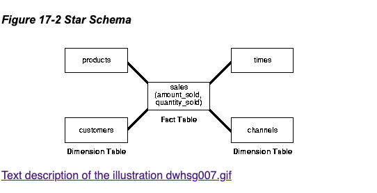
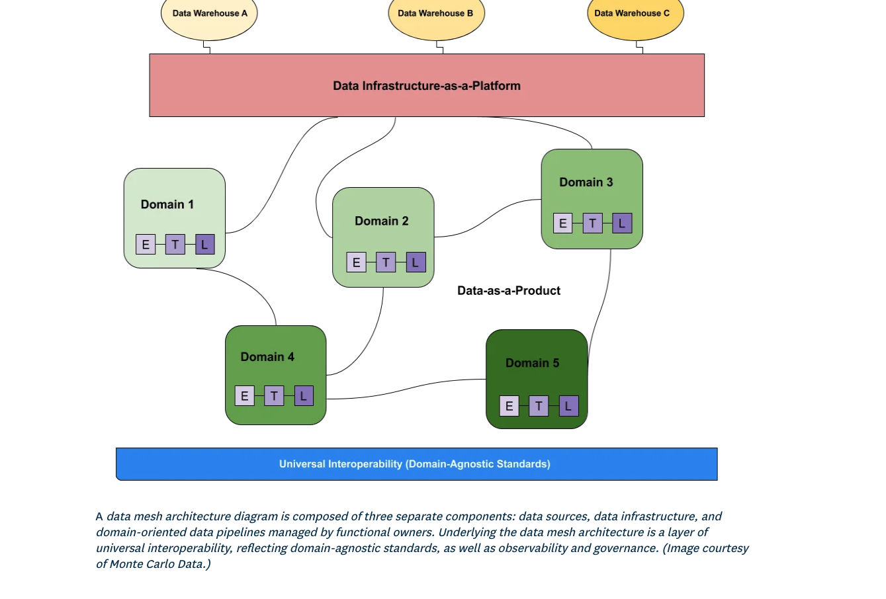

# Data Modeling, ETL & Data Architecture

## Questions to ask right away before building
- Where is the data? How to access?
- What's the SLA?
- format of the data, do we have a data contract?
- PII? do I need to do some light transform before loading? Legal reasons? GDPR?
- query patterns... how should the data be stored/sorted/distributed?
- data scientists have to do many transformations. big SQL. denormalize to a presentation table

## Efficient data modeling design (from requirement gathering, determining the right questions to ask, data onboarding case study)
What Data Sources Are Available?
Identify the various data sources, such as transaction databases, website clickstreams, customer surveys, and social media interactions.

What Are the Business Goals?
Understand the specific objectives, such as increasing customer retention, optimizing marketing spend, or personalizing product recommendations.

What Are the Key Metrics and KPIs?
Determine the critical performance indicators that the analytics platform needs to track, such as customer lifetime value, conversion rates, and customer churn.

Data Volume and Velocity:
Assess the volume and velocity of data. How much data is generated daily, and how frequently does it need to be updated? This will guide your choices for data storage and processing technologies.

Data Quality and Cleansing:
Investigate the quality of the data sources. Are there issues with missing or inconsistent data? Plan for data cleansing and transformation.

Data Security and Compliance:
Are there any data privacy regulations (e.g., GDPR or CCPA) that need to be adhered to? Ensure that the data modeling and storage comply with these regulations.

User Access and Permissions:
Define who in the organization will have access to the analytics platform and what level of permissions they require. This is crucial for data security.

Scalability and Performance:
Consider future scalability requirements. How will the platform handle increased data volume and user load over time?

Technology Stack:
Based on the data sources and requirements, select the appropriate technology stack. This might include databases, data warehousing solutions, ETL tools, and analytics platforms.

Data Governance and Documentation:
Establish data governance practices, including data naming conventions, data dictionaries, and documentation of data transformations and models.

## Case Study

Case Study: Building a Healthcare Analytics System

1. Requirement Gathering:

You've been tasked with developing a Healthcare Analytics System for a hospital. The objective is to improve patient care, optimize resource allocation, and enhance overall hospital operations.
2. Ultimate Questions to Ask Before Data Modeling:

Data Sources:

What are the primary data sources in the healthcare domain, such as electronic health records (EHRs), laboratory results, billing data, and patient demographics?
Do we have access to external sources like public health databases or research studies for broader insights?
Business Objectives:
What are the primary goals of the analytics system? Are we focusing on reducing readmission rates, optimizing staffing levels, or identifying high-risk patients?

Key Metrics and KPIs:
Which healthcare metrics are crucial, such as patient outcomes, length of stay, and cost per case?
What are the key performance indicators (KPIs) that hospital administrators and clinicians need to track?

Data Volume and Real-time Needs:
How much data is generated daily, and do we require real-time access to certain data, such as vital signs or patient admissions?
Will we need to implement data streaming technologies?

Data Quality and Compliance:
How do we ensure the accuracy and completeness of medical records?
What privacy and compliance standards (e.g., HIPAA) must we adhere to, and how will we secure patient data?

User Access and Roles:
Who will be using the system? Define roles and permissions for healthcare providers, administrators, and analysts.
What level of data access is appropriate for each role?

Scalability and Disaster Recovery:
How do we plan for scalability as the hospital expands or acquires new facilities?
What disaster recovery measures are in place to ensure data availability in case of emergencies?

Technology Stack:
What database systems, ETL tools, and analytics platforms are suitable for handling healthcare data and analytics?
Consider factors like interoperability with EHR systems.

Data Governance and Ethics:
Establish data governance practices, including data stewardship, data lineage tracking, and ethical considerations for data usage.

3. Data Onboarding and Modeling:
Data onboarding involves extracting data from various sources (EHRs, billing systems, etc.), transforming it into a usable format, and loading it into the chosen data storage system.
Data modeling design may include creating a healthcare data warehouse with tables for patients, diagnoses, treatments, and medical staff.
Implement measures for data anonymization and de-identification to protect patient privacy.
Consider designing dashboards and reports that provide actionable insights for healthcare professionals.
This case study highlights the critical questions and considerations before embarking on data onboarding and modeling for a healthcare analytics system. If you'd like to explore any specific aspect in more detail or have questions about the technical implementation, feel free to ask for additional information or code examples.


## ETL Development Lifecycle:

Requirement Gathering: Start by understanding the business needs and data requirements. Work closely with stakeholders to define what data needs to be extracted, transformed, and loaded.

Data Extraction:

Identify the source systems where data resides, such as databases, APIs, flat files, or streaming platforms.
Design data extraction processes to retrieve relevant data efficiently.
Consider scheduling and data change detection mechanisms.
Data Transformation:

Cleanse and validate the extracted data to ensure data quality.
Apply transformations like aggregations, joins, filtering, and enrichment to prepare the data for its destination.
Implement business logic and data mapping as required.
Data Loading:

Determine the destination, which can be a data warehouse, database, or data lake.
Load the transformed data into the destination using appropriate methods like batch or real-time loading.
Handle data integrity and error handling during loading.
Testing and Quality Assurance:

Perform thorough testing, including unit testing for individual ETL components and integration testing for the entire ETL pipeline.
Validate data accuracy and consistency throughout the process.
Implement logging and monitoring for error detection.
Deployment:
Deploy ETL processes to the production environment, considering scalability and performance requirements.
Set up scheduling and orchestration to automate ETL job execution.

Maintenance and Monitoring:
Continuously monitor ETL pipelines for data issues, errors, and performance bottlenecks.
Handle updates to source systems and data schema changes gracefully.
Maintain documentation and version control.

ETL Optimization:

Performance Tuning:
Profile your ETL processes to identify performance bottlenecks. Tools like query optimizers and monitoring dashboards can help.
Optimize SQL queries, indexing, and data loading strategies to reduce processing time.

Parallel Processing:
Implement parallel processing to distribute the workload across multiple processors or nodes.
Use distributed computing frameworks like Apache Spark for large-scale data processing.

Data Partitioning:
Partition large datasets to improve query performance. Partitioning can be based on time, region, or other relevant criteria.

Caching and Materialized Views:
Use caching mechanisms or materialized views to store intermediate results, reducing redundant computations.
ETL Code Refactoring:
Regularly review and refactor ETL code to enhance maintainability and reduce complexity.
Eliminate redundant transformations and optimize data flow.

Debugging ETL Processes:

Logging and Monitoring:
Implement comprehensive logging to capture errors, warnings, and processing steps.
Set up monitoring tools to alert you when issues occur.

Data Profiling:
Profile data at various stages of the ETL process to identify data quality problems or anomalies.
Use data profiling tools to automate this process.

## What's an efficient and effective way to data model?

1. Requirement Gathering:

Understand the Business Goals: Begin by understanding the overall business goals and objectives that the data warehouse will support. This might involve meetings with stakeholders to align on the scope and purpose of the project.
Identify Key Metrics: Work closely with business analysts and data stakeholders to identify the key metrics and performance indicators that need to be tracked and analyzed. What questions do they want to answer with the data?
Data Sources: Determine the sources of data that will feed into the data warehouse. This can include databases, APIs, external data providers, and more.

2. Asking the Right Questions:
What Data Is Needed?: Clarify the specific data elements that are required to answer the identified business questions. This might include transaction data, customer information, product details, and more.
Data Granularity: Understand the level of detail needed. Do you need daily, hourly, or monthly data? This influences the design of your data warehouse schema.
Data Transformation: Ask about any required data transformations or calculations. For example, do you need to calculate average sales per customer or year-over-year growth?
Data Retention: Discuss how long historical data should be retained in the data warehouse. Different businesses may have varying compliance requirements or historical analysis needs.

3. Data Onboarding Case Study:

Let's consider a case study for a fictional e-commerce company:
Business Goal: The e-commerce company aims to improve customer retention and increase average order value.

Questions to Ask:
What customer data is needed?: To address this goal, you might need customer information, purchase history, and customer interaction data.
What is the data source?: Determine where this data comes from, such as the company's CRM system and sales database.
Data Granularity: Are daily customer interactions required, or will weekly summaries suffice?
Calculations: Do you need to calculate metrics like customer lifetime value or the average time between purchases?
Data Retention: How many years of historical data should be stored for analysis? Is there a legal requirement to retain certain customer data?

4. Data Modeling:

Choose the Right Data Warehouse Model: Depending on your requirements, you can opt for a star schema, snowflake schema, or other models. For the e-commerce case, a star schema may be suitable.
ETL Process: Define the Extract, Transform, Load (ETL) process to clean, transform, and load data into the warehouse.
Indexes and Performance: Ensure appropriate indexing and performance optimization techniques to handle the expected data volume and query complexity.
Data Quality: Implement data quality checks and validation to maintain the accuracy and reliability of the data.
Documentation: Document the data modeling decisions, schema structures, and transformations for future reference.

Efficient data modeling involves close collaboration between data engineers, data scientists, and business stakeholders to ensure that the data warehouse is designed to meet specific business needs and answer critical questions accurately and efficiently.
Once we make the data model, try to ask the data scientist about recommendations engines. Recommendation Algorithm: Work with data scientists to develop recommendation algorithms that leverage the data model. Collaborate to understand how the algorithm uses the data and what features are crucial.


## ETL vs ELT

- ETL transforms data on a separate processing server, while ELT transforms data within the data warehouse itself.
- ETL does not transfer raw data into the data warehouse, while ELT sends raw data directly to the data warehouse.

### What is ELT

Data is extracted from a source system, loaded into a destination system, and transformed inside the destination system. 

### What is ETL
Data is extracted from a source system, transformed on a secondary processing server, and loaded into a destination system. 

### Benefits of ETL
On the other hand, ETL is ideal for compute-intensive transformations, systems with legacy architectures, or data workflows that require manipulation before entering a target system, such as erasing personal identifying information (PII). Sometimes this happens unintentionally. But with ETL, you will reduce the risk of transferring non-compliant data. Why? Because of the data pipeline, meaning the data is cleaned and filtered before it leaves its initial destination.
- The reasons we had ETL before was because storage particularly cloud storage was expensive so you had to limit the data you were writing in your warehouse to keep costs down. There was loads of benefits for this, the data models were usually well defined, things were built properly by necessity.

### Downsides of ELT
- Enter cheaper storage in recent times and suddenly you got ELT. You extract the raw data from source and dump it into your datalake/dwh. 
- Upside you can chop and change schemas at will since the source data always exists. Downsides less focus on data modelling since everyone is just dumping data into the warehouse and its a free for all.
- **practical example of ELT downsides, i've recently had to process 3.3Tb worth of data on snowflake in one table in one variant column. When it was made two years ago the original creator found it easier to just extract and dump the one stream into the table then create downstream tables later. This is all well and good initially but 2 years later the data grew and their query time grew with it. So it cost me 8 hours to deconstruct the variant type into a better model that can better server its downstream assets.

Most pipelines are EtLT. The t being "tweak" for some data cleaning, PII removals, etc. YMMV depending on use case.

## Some tips:
https://towardsdatascience.com/5-helpful-extract-load-practices-for-high-quality-raw-data-65b9a59a8721

But here are a few that stood out:

1. Make each EL run uniquely identifiable — timestamp everything
We start with arguably the most important best practice: Make every bit of data you load into your data system identifiable and traceable back to the process that got it there.

Typical ways of doing this are to include metadata values that capture:

- Ingestion time: the timestamp indicating when the load process started.
- Ingestion process: a unique identifier representing the load process and its instance.
- Source system: Metadata about where the data was extracted from.

2. Deduplicate data at a level beyond the raw level
There are usually three cases of duplicate data hitting your data systems you will want to “deduplicate.” But no matter the case, don’t do it at the raw/landing level!

The first case is intentional duplicate data, where a source system contains something your end-users or you consider duplicated. For instance, your CRM system might have two entries for a certain customer that canceled and signed up again. If you deduplicate at the raw level, this means either merging the two or deleting one. Both of which will delete data that is present in the source system.

The second case is unintentional duplicate data, where the source system either deletes a record you still have in your data warehouse or the source system unintentionally produces duplicate data it will likely delete in the future. Even though this is an “error,” I don’t recommend deleting this data in your raw ingestion area but rather filter it further down the line, for instance, in the next stage of your modeling. Otherwise, you add logic to your ingestion that is hard to follow up on later.

The third case is duplication happening due to technical restrictions. It might be the case that your ingestion tooling prefers an “at least once delivery” strategy, or it might even be a bug in an ingestion process. With “at least once delivery” incremental load strategies, you’re ensuring to get all data rows but might duplicate some. Again we recommend keeping the duplicate data at the raw level and filtering it down at a later level.

3. Don’t flatten during EL, do it one stage later
Many source systems you ingest will return arrays, JSONs, or other nested objects with some hierarchy you want to break down for further processing. But not at the ingestion level. Take the raw data and dump it as it is in your data system, then have a process do your “flattening.”

A very typical example is JSON objects. Your source might contain a large JSON object, and you would like to have it processed into individual columns inside your Snowflake database. This practice suggests first having a raw table with just your metadata columns and one “JSON_blob” column containing the JSON object. In a second step, you can then process this data into columns.

The reason for this is that flattening involves business logic. It involves you knowing what properties are “always there.” If you flatten on ingestion, your ingestion process might break because one JSON object is NULL, or one JSON object doesn’t come with one expected value. It is always easier to take the already ingested data and rerun your flattener than to run your ingestion + flattening process together.

## Some other topics

### First normal form

First Normal Form with Example
If a relation contains a composite or multi-valued attribute, it violates the first normal form, or the relation is in the first normal form if it does not contain any composite or multi-valued attribute. A relation is in first normal form if every attribute in that relation is single-valued attribute. 



### not second normal form


This causes the following anomalies:

Update Anomalies
If a supplier moves locations, every single stock entry must be updated with the new city.

Insertion Anomalies
The city has to be known at insert time in order to stock a part at a supplier. Really what matters here is the supplier_id and not the city. Also unless the city is stored elsewhere a supplier cannot have a city without having parts, which does not reflect the real world.

Deletion Anomalies
If the supplier is totally out of stock, and a row disappears, the information about the city in which the supplier resides is lost. Or it may be stored in another table, and city does not need to be in this table anyway.

Separating this into two tables achieves 2nd normal form. See image below



### Third normal form
Getting to Third Normal Form
The goal of getting to third normal form is to eliminate update, insertion, and deletion anomalies.

Take this employee, city, and department table as an example:



We’re almost there! With 1st normal form, we ensured that every column attribute only holds one value.
With 2nd normal form we ensured that every column is dependent on the primary key, or more specifically that the table serves a single purpose.
With 3rd normal form, we want to ensure that non-key attributes are dependent on nothing but the primary key. The more technical explanation involves “transitive dependencies” but for the purpose of this simplified explanation we’ll save that for another day.

In the case of the following table, zip is an attribute generally associated with only one city and state. So it is possible with a data model below that zip could be updated without properly updating the city or state. This would be bad. If we ever update zip, we should update city and state.



### Benefits of Normalization
Normalizing data helps minimize redundancy and maintain the highest levels of integrity. By organizing column attributes and the relations between tables, data administrators can design systems for efficiency and safety.

More specifically, normalization helps ensure
- Data is not unnecessarily repeated within a database
- Inserts, modifications, and deletions only have to happen once in a database


## Star schema
Star schemas are often implemented in a denormalized fashion, with typical normalization rules relaxed. The advantage of this can be simpler reporting logic and faster performance as data may be stored multiple ways to facilitate queries.

The disadvantage of this approach is that integrity is not necessarily enforced through the model leaving room for an update in one place that may not successfully propagate elsewhere.
Star schemas often skip normalization for two reasons: simplicity of queries and performance.


Star schemas denormalize the data, which means adding redundant columns to some dimension tables to make querying and working with the data faster and easier. The purpose is to trade some redundancy (duplication of data) in the data model for increased query speed, by avoiding computationally expensive join operations.

In this model, the fact table is normalized but the dimensions tables are not. That is, data from the fact table exists only on the fact table, but dimensional tables may hold redundant data.

The star schema is perhaps the simplest data warehouse schema. It is called a star schema because the entity-relationship diagram of this schema resembles a star, with points radiating from a central table. The center of the star consists of a large fact table and the points of the star are the dimension tables.

A star schema is characterized by one or more very large fact tables that contain the primary information in the data warehouse, and a number of much smaller dimension tables (or lookup tables), each of which contains information about the entries for a particular attribute in the fact table.

A star query is a join between a fact table and a number of dimension tables. Each dimension table is joined to the fact table using a primary key to foreign key join, but the dimension tables are not joined to each other. The cost-based optimizer recognizes star queries and generates efficient execution plans for them.

A typical fact table contains keys and measures. For example, in the sh sample schema, the fact table, sales, contain the measures quantity_sold, amount, and cost, and the keys cust_id, time_id, prod_id, channel_id, and promo_id. The dimension tables are customers, times, products, channels, and promotions. The product dimension table, for example, contains information about each product number that appears in the fact table.

A star join is a primary key to foreign key join of the dimension tables to a fact table.

The main advantages of star schemas are that they:
- Provide a direct and intuitive mapping between the business entities being analyzed by end users and the schema design.
- Provide highly optimized performance for typical star queries.
- Are widely supported by a large number of business intelligence tools, which may anticipate or even require that the data-warehouse schema contain dimension tables
- Star schemas are used for both simple data marts and very large data warehouses.




## Fact tables

A fact table or a fact entity is a table or entity in a star or snowflake schema that stores measures that measure the business, such as sales, cost of goods, or profit.
Fact tables and entities aggregate measures, or the numerical data of a business. To measure data in a fact table or entity, all of the measures in a fact table or entity must be of the same grain.

To obtain the most useful data in a fact table or entity, you should use measures that are both numeric and additive. Using these measures guarantees that data can be retrieved and aggregated, so that the business can make use of the wealth of business data in the database.

Fact tables and entities also contain foreign keys to the dimension tables. These foreign keys relate each row of data in the fact table to its corresponding dimensions and levels.

Fact tables and entities use primary keys that are composite keys. A composite key is made up of a subset of other keys. If a table or entity in a dimensional model uses a composite key, then that table is a fact table or entity. The use of composite keys causes the table or entity to have a many-to-many relationship with other tables and entities in the dimensional model.

Fact table and entity types
There are three types of fact tables and entities:
Transaction
A transaction fact table or transaction fact entity records one row per transaction.
Periodic
A periodic fact table or periodic fact entity stores one row for a group of transactions that happen over a period of time.
Accumulating
An accumulating fact table or accumulating fact entity stores one row for the entire lifetime of an event. An example of an accumulating fact table or entity records the lifetime of a credit card application from the time it is sent to the time it is accepted.
Note: You cannot explicitly specify the type of fact table or entity by using the workbench. To document the types of fact tables that you are using, you can add the information to the documentation.
The following table compares the different types of fact tables and entities. The table emphasizes that each has a different type of grain and that there are differences in how insert and update operations occur in each. For example, in transaction and periodic fact tables and entities, only insert operations occur. However, in an accumulating fact table or entity, the row is first inserted, and as a milestone is achieved and additional measures are made available, the table or entity is subsequently updated.


## Dimension Tables

A dimension table or dimension entity is a table or entity in a star, snowflake, or starflake schema that stores details about the facts. For example, a Time dimension table stores the various aspects of time such as year, quarter, month, and day.
Dimension table store descriptive information about the numerical values in a fact table. For example, dimension tables for a marketing analysis application might include Time Period, Marketing Region, and Product Type.

Dimension tables describe the different aspects of a business process. For example, if you are looking to determine the sales targets, you can store the attributes of the sales targets in a dimension table. Dimension tables group the data in the database when the business creates reports. For example, you can group sales targets by country, product, or retailer, and those groupings are stored in dimension tables.

Each dimension table contains a number of columns and attributes that are used to describe business processes.

Since the data in a dimension table is often denormalized, dimension tables have a large number of columns. The dimension tables contain fewer rows of data than the fact table. The columns of a dimensional table are used to create reports or display query results. For example, the textual descriptions of a report are created from the column labels of a dimension table.

Consider the following points when you create your dimension tables:
Grain
Each dimension table has only one element at the lowest level of detail, and this element is known as the grain of the dimension.

Non-key elements
Each non-key element should appear in only one dimension table.

Time and date dimensions
You will typically have multiple time and date dimensions in your dimensional model.

Number of dimensions
Dimensional models typically contain only 10 to 15 dimension tables. If you need more dimensions, merge those dimension tables into a single table.

Creating one-to-many relationships
The rows in a dimension table establish a one-to-many relationship with the fact table or outriggers.

Shared dimensions
Typically, dimension tables that are shared by multiple fact tables (or multiple dimensional models) are called shared dimensions. If shared dimensions already exist for any of the dimensions in the data warehouse or dimensional model, you should use the shared dimensions. If you are developing new dimensions that may be used across the entire enterprise warehouse, you should develop a design that anticipates the needs of the enterprise warehouse.

### P hacking

To take a toy example, suppose you wanted to establish a link between chocolate and baldness. You could then get a group of 10,000 men (a pretty big sample size by all accounts) to report on their consumption of M&Ms, Twix and Mars Bars over a period of time. In addition, you record the rate of going bald in the group over time.

P Hacking
Once you have your chocolate and baldness data, you run tests on everything you can think of. Do men who eat only M&Ms go bald younger? Do young men who eat both Mars and M&Ms but not Twix go bald on top more often than the front? Do older unmarried men who don’t exercise and eat none have a lower incidence of baldness?

Run enough of these tests and you are eventually bound to get a result that is ‘statistically significant’.

A p-value of 0.001, the probability of a result occurring randomly just 1 in 1000 times, is generally judged to be pretty significant: it’s very unlikely the association came about by chance, and there is most likely some factor behind it.

This is based on the assumption, of course, that you are not running thousands of tests in order to find that 1 in a 1000 occurrence.

Honest science demands that scientists go into their research with a clear, motivated hypothesis – for example, that we have reason to believe that this particular chemical causes this type of cancer, and we want to test this. For this reason, p-hacking is considered to be highly unethical.

### Denormalized Dimension Tables:

Product Dimension Table (Denormalized):
Contains product attributes like product name, category, and brand.
May also contain redundant information, like category name repeated for each product, for query performance.

Customer Dimension Table (Denormalized):
Contains customer attributes like customer name, email, and age.
May also include repeated information, such as customer city, for the same reason.

Date Dimension Table (Denormalized):
Contains date attributes like date, month, and year.
May also have repeated data, such as month name, for faster aggregation.
This denormalization approach simplifies queries because it reduces the need for complex joins when retrieving data. However, it's important to note that this design choice can result in increased storage requirements due to redundancy.

## Why use a data lakehouse like Spectrum and S3
https://aws.amazon.com/blogs/big-data/build-a-lake-house-architecture-on-aws/

A problem a company had: (In short, event data grows too fast) 
Certain data sources being stored in our Redshift cluster were growing at an unsustainable rate, and we were consistently running out of storage resources.

Running Off a Horizontal Cliff
After a brief investigation, we determined that one specific dataset was the root of our problem. The dataset in question stores all event-level data for our application. This type of dataset is a common culprit among quickly growing startups. We store relevant event-level information such as event name, the user performing the event, the url on which the event took place, etc for just about every event that takes place in the Mode app. As our user base has grown, the volume of this data began growing exponentially. By the start of 2017, the volume of this data already grew to over 10 billion rows
In most cases, the solution to this problem would be trivial; simply add machines to our cluster to accommodate the growing volume of data. We hit an inflection point, however, where the volume of data was growing at such a rate that scaling horizontally by adding machines to our Redshift cluster was no longer technically or financially sustainable. To add insult to injury, a majority of the event data being stored was not even being queried often. It simply didn’t make sense to linearly scale our Redshift cluster to accommodate an exponentially growing, but seldom-utilized, dataset. We needed a way to efficiently store this rapidly growing dataset while still being able to analyze it when needed. And we needed a solution soon.

In April 2017, AWS announced a new technology called Redshift Spectrum. With Spectrum, AWS announced that Redshift users would have the ability to run SQL queries against exabytes of unstructured data stored in S3, as though they were Redshift tables. In addition, Redshift users could run SQL queries that spanned both data stored in your Redshift cluster and data stored more cost-effectively in S3. Redshift users rejoiced, as it seemed that AWS had finally delivered on the long-awaited separation of compute and storage within the Redshift ecosystem.

This was welcome news for us, as it would finally allow us to cost-effectively store infrequently queried partitions of event data in S3, while still having the ability to query and join it with other native Redshift tables when needed.

But how does Redshift Spectrum actually do this? Mainly, via the creation of a new type of table called an External Table.

External tables in Redshift are read-only virtual tables that reference and impart metadata upon data that is stored external to your Redshift cluster. This could be data that is stored in S3 in file formats such as text files, parquet and Avro, amongst others. Creating an external table in Redshift is similar to creating a local table, with a few key exceptions. You need to:

Assign the external table to an external schema.
Tell Redshift where the data is located.
Tell Redshift what file format the data is stored as, and how to format it.
That’s it. Once you have your data located in a Redshift-accessible location, you can immediately start constructing external tables on top of it and querying it alongside your local Redshift data. For us, what this looked like was unloading the infrequently queried partition of event data in our Redshift to S3 as a text file, creating an external schema in Redshift, and then creating an external table on top of the data now stored in S3. Once this was complete, we were immediately able to start querying our event data stored in S3 as if it were a native Redshift table.


## Data types supported by Amazon Redshift
Since Redshift Spectrum is an extended feature of Redshift, it supports
same data formats as used in Redshift tables/views. However, there are
some limitations in using DATE and TIMESTAMP data types. Please refer
to the AWS documentation for complete details.

Data catalog for Redshift Spectrum
Data stored in Redshift Spectrum are in the form of tables called as
External table. However, they are not a normal table stored in the cluster,
unlike Redshift tables. The actual data is being stored in S3. You have to
use standard Redshift SQL queries to examine those external tables. In
Redshift, you need to create a schema in Redshift cluster; while in
Redshift Spectrum, a schema is being referenced in the external database
called data catalog. Data Catalog an index to the location and metrics of
Spectrum data.

Before you load data in Redshift Spectrum tables, you need to create a
data catalog which Spectrum needs to refer. Redshift spectrum refers
data catalog from Amazon Athena/Glue/EMR. Redshift schema external
tables can also be viewed in Amazon Athena/Glue/EMR and vice-versa

## Kafka

Kafka allows scaling by use of partitions. Having multiple partitions for a topic, allows consumption of messages by multiple consumers, one per partition, thus parallelising the reads by multiple consumers and getting better throughout (scale). Kafka ensures that only one consumer from each consumer group can consume from a partition. 

### Schema on read vs schema on write
Schema-on-Write is associated with Relational Database Schema
Databases have employed a Schema-on-Write paradigm for decades, that is, the schema/table structure is first defined up front and then the data is written to the said schema as a part of the write process. Once the data has been written to the schema it is then available for reading, as such it’s named Schema-on-Write.

ETL from relational databases needs Schema-on-Write. The Schema-on-Write approach means the tables must be created first and schemas configured before data can be ingested. Relational databases have structured data whose structure is known in advance, so you can create tables accordingly, defining columns, data formats, column relationships at destination before the data is uploaded and available for analytical queries.


Schema-on-Read is associated with the rise of Data Lakes
Schema-on-Read has come about in conjunction with the rise of data lakes primarily for data science use cases and Machine Learning models. Here the raw data is first landed in its native form (structured and/or unstructured) with no imposed schema. Only once the data is read is the schema is applied, hence Schema-on-Read. Schema-on-Read is the opposite of Schema-in-Write. With the Schema-on-Read approach, the schema is created only when the data is read and not before data ingestion. Data schema are created while the ETL process is carried out. This enables raw, unstructured data to be stored in the database

DBT, by virtue of its models and file names, does Schema-On-Read

### Schema on read
The schema-on-read concept counterbalances the schema-on-write construct. The database schema is created when the data is read. The data structures are not applied or initiated before the data is ingested into the database; they are created during the ETL process. This enables unstructured data to be stored in the database (much like our jsonb columns during into DBT models and tables at Hinge).

The primary reason for developing the schema-on-read principle is the exploding growth of unstructured data volumes and the high overhead involved during the schema-on-write process. 

One example of a schema-on-read data loading process: Using Upsolver SQLake and  Amazon Athena to ingest and analyze raw data stored in an Amazon S3 data lake. Amazon Athena is a SQL engine that runs on top of the S3 data lake; you write SQL statements to query the data in the database:


### How does schema on read even work?

- The schema is inferred from the raw data, using SQlake to parse and stream the data and Amazon Glue Data Catalog to connect the metadata, schema, and data. 
- Athena then runs a SQL query to analyze the data in the data lake.
- As the query runs, SQLake ingests the data based on the schema-on-read principle. The ETL layer creates the database schema based on the schema-on-read.  The result: if your data lake contains live data, by using the schema-on-read construct new fields are added to the database schema as the data is loaded.

In this context let’s revisit the example of the taxi:

- The transactional data with details about each trip a taxi driver makes is loaded into an S3 data lake in near real-time. Most of the data is the same.
- At some point new data is added to this feed – for example, weather details for each trip. Until this point, the software application that records trip data only recorded general weather information such as snow, rain, or sunshine. The new data includes the precipitation amount, the time of day it fell, and how long it lasted.
- The schema-on-read process automatically creates new fields in the trip database table and ingests the data.

### Benefit of schema on read

Schema-on-Read is much faster than Schema-on-Write since the schema does not need to be defined prior to loading. This is a huge advantage in a big data environment with lots of unstructured data. The Schema-on-Read process can scale up rapidly as per requirement and can consume vast volumes of data in quick time, since it is not constrained by data modelers required in the case of a rigid database. 

When schema is generated on write, the schema comes before the data. A very common schema on write scenario is that a data engineer creates several tables in a relational database that are connected by primary keys with a rigid schema. Then, the data engineer populates the table with data. In a schema on read scenario, different types of data, potentially both structured and unstructured, are loaded into the destination, and the schema is generated when queries against the data are executed. This means the data engineer can spend more time crafting queries to gain better insights rather than spending all of their time carefully defining fields.

Based on the information described above, it is reasonable to assume that the schema-on-read principle is superior to the schema-on-write principle, especially in an environment where there are large amounts of unstructured data, such as the data that falls within the Big Data ambit.

Not only is the schema-on-read process **faster** than the schema-on-write process, but it also has the capacity to scale up rapidly. The reason being is that the schema-on-read construct does not utilize data modelers to model a rigid database. It consumes the data as it is being read and is suitable for massive volumes of unstructured data.  

Handles schema drift naturally.

## What is data management
Succinctly stated, “data management is the process of ingesting, storing, organizing, and maintaining the data created and collected by an organization.” Juxtapositionally, the lack of data management leads to incompatible data silos, inconsistent data sets, data swamps instead of data lakes, and data quality problems, resulting in the limited ability of BI (Business Intelligence) and analytics applications to produce correct and viable information. 

## What is data partitioning
Data Partitioning in Data Lakes is the practice of dividing data sets into smaller, more manageable parts based on specific criteria, such as time, location, or any other relevant attribute. This technique creates a logical structure within a data lake, enabling efficient data retrieval and analysis.

Data Warehouse Partitioning is a technique used in data warehousing to improve query performance and optimize resource utilization. By dividing large tables into smaller, more manageable units called partitions, businesses can significantly reduce processing time and achieve better query response.

### How partitioning works
folders where data is stored on S3, which are physical entities, are mapped to partitions, which are logical entities, in a metadata store such as Glue Data Catalog or Hive Metastore. As covered in AWS documentation, Athena leverages these partitions in order to retrieve the list of folders that contain relevant data for a query.

Data is commonly partitioned by time, so that folders on S3 and Hive partitions are based on hourly / daily / weekly / etc. values found in a timestamp field in an event stream. Here’s an example of how Athena partitioning would look for data that is partitioned by day:

Athena matches the predicates in a SQL WHERE clause with the table partition key. The best partitioning strategy enables Athena to answer the queries you are likely to ask while scanning as little data as possible, which means you’re aiming to filter out as many partitions as you can.

For example – if we’re typically querying data from the last 24 hours, it makes sense to use daily or hourly partitions. Monthly partitions will cause Athena to scan a month’s worth of data to answer that single day query, which means we are scanning ~30x the amount of data we actually need, with all the performance and cost implication.

Suppose you want to run the following query: select count(*) from the_table where country = 'Angola'. This query will run faster if the data lake is partitioned by the country column. The query engine only needs to list and read the data files in the country='Angola' directory. It can skip the data files in the other directories.

Engines need to run file listing operations to determine the files that must be read for different queries. Hive-style partitioning allows the query engine to read less files for certain queries.

For a query like select count(*) from the_table, the Hive-style partitioning doesn’t allow for any data skipping, so the query won’t run any faster. The Hive-style partitioning can actually make queries that can’t leverage data skipping run far slower.

### How to partition
 Partition columns are usually designed by a common query pattern in your use case. For example, a common practice is to partition the data based on year/month/day because many queries tend to run time series analyses in typical use cases. This often leads to a multi-level partitioning scheme. Data is organized in a hierarchical directory structure based on the distinct values of one or more columns.

Let’s look at an example of how partitioning works.

Files corresponding to a single day’s worth of data are placed under a prefix such as s3://my_bucket/logs/year=2023/month=06/day=01/.

If your data is partitioned per day, every day you have a single file, such as the following:

s3://my_bucket/logs/year=2023/month=06/day=01/file1_example.json
s3://my_bucket/logs/year=2023/month=06/day=02/file2_example.json
s3://my_bucket/logs/year=2023/month=06/day=03/file3_example.json
We can use a WHERE clause to query the data as follows:

SELECT * FROM table WHERE year=2023 AND month=06 AND day=01
The preceding query reads only the data inside the partition folder year=2023/month=06/day=01 instead of scanning through the files under all partitions. Therefore, it only scans the file file1_example.json.

Systems such as Athena, Amazon Redshift Spectrum, and now AWS Glue can use these partitions to filter data by value, eliminating unnecessary (partition) requests to Amazon S3. This capability can improve the performance of applications that specifically need to read a limited number of partitions. 


**it's also est to use system or server time instead of client time because clients might be down or send data late. So in order to not have to handle late arriving data (maybe months later), we should use the server's received time as the partitiong time so we don't have to handle late arriving data. The late arriving client data would still be in a current partition in the data lake but still retain its client time column.**

## Benefits of partitioning
Reducing query execution time and improving performance
Optimizing resources and minimizing operational costs
Data Warehouse Partitioning can substantially improve query performance by reducing data scanning, pruning irrelevant partitions, and facilitating parallel processing. However, the performance benefits depend on the proper design and implementation of partitioning strategies.


## Partitioning on s3

Large organizations processing huge volumes of data usually store it in Amazon Simple Storage Service (Amazon S3) and query the data to make data-driven business decisions using distributed analytics engines such as Amazon Athena. If you simply run queries without considering the optimal data layout on Amazon S3, it results in a high volume of data scanned, long-running queries, and increased cost.

## Hive style

If you look at the Athena documentation you often see data organized with paths that contain key value pairs, like country=fr/… or year=2020/month=06/day=26/…. This is Hive style (or format) partitioning. The paths include both the names of the partition keys and the values that each path represents. It can be convenient and self documenting, but it’s also uncommon to see it outside outside the Hadoop and Hive ecosystem, where it originated.

A self-documenting scheme
Consider a file listing like this one:

```
data/day=2020-04-20/country=fr/7fc6742c.json
data/day=2020-04-20/country=ir/80af7e0c.json
data/day=2020-04-20/country=se/f76c0d8f.json
data/day=2020-04-20/country=us/cf7e76b9.json
data/day=2020-04-21/country=af/cb81aacf.json
data/day=2020-04-21/country=ch/6b8ea57f.json
data/day=2020-04-21/country=fr/0c8e74a2.json
data/day=2020-04-21/country=us/68af2b83.json
```

You can probably guess that the data is partitioned by day and country just by looking at the file paths. The benefit of this style is that it is more or less self-documenting. Both humans and computers can see how the data is partitioned, and select only the files relevant for a query that includes conditions on day and country.

If you are starting from scrach and have full control over how the data in your data lake is organized, this is a good convention to follow, and it is understood by many tools in the Hadoop ecosystem.

Often, though, you don’t fully control the way data is produced and organized, and most tools outside of the Hadoop world don’t organize data using the Hive style. Instead, you probably get files organized like this:

```
data/2020-04-20/fr/7fc6742c.json
data/2020-04-20/ir/80af7e0c.json
data/2020-04-20/se/f76c0d8f.json
data/2020-04-20/us/cf7e76b9.json
data/2020-04-21/af/cb81aacf.json
data/2020-04-21/ch/6b8ea57f.json
data/2020-04-21/fr/0c8e74a2.json
data/2020-04-21/us/68af2b83.json
```

This listing has the same files, and if you were presented with this listing you would still figure out how it was organized. This is probably also how most people would organize this data set if given no specific instructions. As long as there is some documentation on what the path components mean it’s also not really any worse than the Hive style, except that Hive-aware tools can’t use it directly.

Another variant that is fairly common, and used by, for example, CloudTrail and Kinesis Firehose is using separate path components for the date parts, e.g. data/2020/04/20/fr/7fc6742c.json.


## Partitioning data in Athena
https://docs.aws.amazon.com/athena/latest/ug/partitions.html

By partitioning your data, you can restrict the amount of data scanned by each query, thus improving performance and reducing cost. You can partition your data by any key. A common practice is to partition the data based on time, often leading to a multi-level partitioning scheme. For example, a customer who has data coming in every hour might decide to partition by year, month, date, and hour. Another customer, who has data coming from many different sources but that is loaded only once per day, might partition by a data source identifier and date.

Athena can use Apache Hive style partitions, whose data paths contain key value pairs connected by equal signs (for example, country=us/... or year=2021/month=01/day=26/...). Thus, the paths include both the names of the partition keys and the values that each path represents. To load new Hive partitions into a partitioned table, you can use the MSCK REPAIR TABLE command, which works only with Hive-style partitions.

Athena can also use non-Hive style partitioning schemes. For example, CloudTrail logs and Kinesis Data Firehose delivery streams use separate path components for date parts such as data/2021/01/26/us/6fc7845e.json. For such non-Hive style partitions, you use ALTER TABLE ADD PARTITION to add the partitions manually.


# NoSQL vs SQL

In contrast, NoSQL databases were designed for unstructured data. As explained previously, these can be column-oriented databases, graph databases, document stores, or key-value stores.
In NoSQL databases, data is stored together (not separately, as with SQL). This means that it’s faster to perform read or write operations on one data entity compared with SQL databases.
Essentially, SQL is great for protecting data validity, whereas NoSQL is ideal for when you need fast availability of big data.

NoSQL is great for just fast lookups of non-relational data, it stores all the data together in a document.

NoSQL is a type of database that does not use the traditional table-based structure of relational databases. Instead, it uses a more flexible schema-less design. This means that data can be stored in any format and there is no need to predefine the structure of the data beforehand. NoSQL databases are often used for big data applications where scalability is important. They can also be used for real-time web applications where data needs to be accessed quickly.

## NoSQL benefits:
1. Fast queries
With NoSQL, it’s faster to run queries on large data sets. SQL can also be fast, but its speed becomes hampered as the database grows. This does not happen with NoSQL databases since they don’t require joins.

2. Resilient and stable
Because NoSQL data is spread over many regions and servers, there is no single point of failure. This means they provide zero downtime and continuous availability.

3. Cheaper in comparison
Since you can scale NoSQL databases horizontally by adding servers, you can expand them relatively cheaply. You should be able to find affordable options regardless of your organization’s needs.

4. Agile 
Rows and columns don’t stifle NoSQL databases, so they can handle all kinds of data, such as unstructured, structured, and polymorphic data.


# Other technologies:

## What is Spark vs Hadoop?

How does Apache Spark work?
Hadoop MapReduce is a programming model for processing big data sets with a parallel, distributed algorithm. Developers can write massively parallelized operators, without having to worry about work distribution, and fault tolerance. However, a challenge to MapReduce is the sequential multi-step process it takes to run a job. With each step, MapReduce reads data from the cluster, performs operations, and writes the results back to HDFS. Because each step requires a disk read, and write, MapReduce jobs are slower due to the latency of disk I/O.

Spark was created to address the limitations to MapReduce, by doing processing in-memory, reducing the number of steps in a job, and by reusing data across multiple parallel operations. With Spark, only one-step is needed where data is read into memory, operations performed, and the results written back—resulting in a much faster execution. Spark also reuses data by using an in-memory cache to greatly speed up machine learning algorithms that repeatedly call a function on the same dataset. Data re-use is accomplished through the creation of DataFrames, an abstraction over Resilient Distributed Dataset (RDD), which is a collection of objects that is cached in memory, and reused in multiple Spark operations. This dramatically lowers the latency making Spark multiple times faster than MapReduce, especially when doing machine learning, and interactive analytics.

## Some parts of the Spark Framework
Spark Core is the foundation of the platform. It is responsible for memory management, fault recovery, scheduling, distributing & monitoring jobs, and interacting with storage systems. Spark Core is exposed through an application programming interface (APIs) built for Java, Scala, Python and R. These APIs hide the complexity of distributed processing behind simple, high-level operators.

Spark SQL
Spark SQL is a distributed query engine that provides low-latency, interactive queries up to 100x faster than MapReduce. It includes a cost-based optimizer, columnar storage, and code generation for fast queries, while scaling to thousands of nodes. Business analysts can use standard SQL or the Hive Query Language for querying data. Developers can use APIs, available in Scala, Java, Python, and R. It supports various data sources out-of-the-box including JDBC, ODBC, JSON, HDFS, Hive, ORC, and Parquet. Other popular stores—Amazon Redshift, Amazon S3, Couchbase, Cassandra, MongoDB, Salesforce.com, Elasticsearch, and many others can be found from the Spark Packages ecosystem.

The Spark library MLlib  is used for Machine Learning . Spark includes MLlib, a library of algorithms to do machine learning on data at scale. Machine Learning models can be trained by data scientists with R or Python on any Hadoop data source, saved using MLlib, and imported into a Java or Scala-based pipeline. Spark was designed for fast, interactive computation that runs in memory, enabling machine learning to run quickly. The algorithms include the ability to do classification, regression, clustering, collaborative filtering, and pattern mining.

## Key differences: Apache Spark vs. Apache Hadoop
Outside of the differences in the design of Spark and Hadoop MapReduce, many organizations have found these big data frameworks to be complimentary, using them together to solve a broader business challenge.

Hadoop is an open source framework that has the Hadoop Distributed File System (HDFS) as storage, YARN as a way of managing computing resources used by different applications, and an implementation of the MapReduce programming model as an execution engine. In a typical Hadoop implementation, different execution engines are also deployed such as Spark, Tez, and Presto.

Spark is an open source framework focused on interactive query, machine learning, and real-time workloads. It does not have its own storage system, but runs analytics on other storage systems like HDFS, or other popular stores like Amazon Redshift, Amazon S3, Couchbase, Cassandra, and others. 


## Data Governance

What is Data Governance?
Data governance refers to the set of roles, processes, policies and tools which ensure proper data quality throughout the data lifecycle and proper data usage across an organization. Data governance allows users to more easily find, prepare, use and share trusted datasets on their own, without relying on IT.

Data governance is everything you do to ensure data is secure, private, accurate, available, and usable. It includes the actions people must take, the processes they must follow, and the technology that supports them throughout the data life cycle.

Data governance means setting internal standards—data policies—that apply to how data is gathered, stored, processed, and disposed of. It governs who can access what kinds of data and what kinds of data are under governance. Data governance also involves complying with external standards set by industry associations, government agencies, and other stakeholders. 

Poor data governance can also hamper regulatory compliance initiatives. That could cause problems for companies that need to comply with the increasing number of data privacy and protection laws, such as the European Union's GDPR and the California Consumer Privacy Act (CCPA). An enterprise data governance program typically includes the development of common data definitions and standard data formats that are applied in all business systems, boosting data consistency for both business and compliance uses.

Data governance goals and benefits
A key goal of data governance is to break down data silos in an organization. Such silos commonly build up when individual business units deploy separate transaction processing systems without centralized coordination or an enterprise data architecture. Data governance aims to harmonize the data in those systems through a collaborative process, with stakeholders from the various business units participating.

Another data governance goal is to ensure that data is used properly, both to avoid introducing data errors into systems and to block potential misuse of personal data about customers and other sensitive information. That can be accomplished by creating uniform policies on the use of data, along with procedures to monitor usage and enforce the policies on an ongoing basis. In addition, data governance can help to strike a balance between data collection practices and privacy mandates.

Besides more accurate analytics and stronger regulatory compliance, the benefits that data governance provides include improved data quality; lower data management costs; and increased access to needed data for data scientists, other analysts and business users. Ultimately, data governance can help improve business decision-making by giving executives better information. Ideally, that will lead to competitive advantages and increased revenue and profits.

## DAta Mesh

What is a data mesh?
A data mesh is a decentralized data architecture that organizes data by a specific business domain—for example, marketing, sales, customer service, and more—providing more ownership to the producers of a given dataset. The producers’ understanding of the domain data positions them to set data governance policies focused on documentation, quality, and access. This, in turn, enables self-service use across an organization. While this federated approach eliminates many operational bottlenecks associated with centralized, monolithic systems, it doesn't necessarily mean that you can't use traditional storage systems, like data lakes or data warehouses. It just means that their use has shifted from a single, centralized data platform to multiple decentralized data repositories.

It's worth noting that data mesh promotes the adoption of cloud native and cloud platform technologies to scale and achieve the goals of data management. This concept is commonly compared to microservices to help audiences understand its use within this landscape. As this distributed architecture is particularly helpful in scaling data needs across an organization, it can be inferred that a data mesh may not be for all types of businesses; that is, smaller businesses may not reap the benefits of a data mesh as their enterprise data may not be as complex as a larger organization.  



What are the principles of data mesh architecture?
Your organization must implement the following four principles to adopt the data mesh paradigm.

Distributed domain-driven architecture
The data mesh approach proposes that data management responsibility is organized around business functions or domains. Domain teams are responsible for collecting, transforming, and providing data related to or created by their business functions. Instead of domain data flowing from data sources into a central data platform, a specific team hosts and serves its datasets in an easily consumable way. For example, a retailer could have a clothing domain with data about their clothing products and a website behavior domain that contains site visitor behavior analytics.

Data as a product
For a data mesh implementation to be successful, every domain team needs to apply product thinking to the datasets they provide. They must consider their data assets as their products and the rest of the organization's business and data teams as their customers.

For the best user experience, the domain data products should have the following basic qualities.

Discoverable
Each data product registers itself with a centralized data catalog for easy discoverability.

Addressable
Every data product should have a unique address that helps data consumers access it programmatically. The address typically follows centrally decided naming standards within the organization.

Trustworthy
Data products define acceptable service-level objectives around how closely the data reflects the reality of the events it documents. For example, the orders domain could publish data after verifying a customer’s address and phone number.

Self-describing
All data products have well-described syntax and semantics that follow standard naming conventions determined by the organization.

Self-serve data infrastructure
A distributed data architecture requires every domain to set up its own data pipeline to clean, filter, and load its own data products. A data mesh introduces the concept of a self-serve data platform to avoid duplication of efforts. Data engineers set up technologies so that all business units can process and store their data products. Self-serve infrastructure thus allows a division of responsibility. Data engineering teams manage the technology while business teams manage the data.
